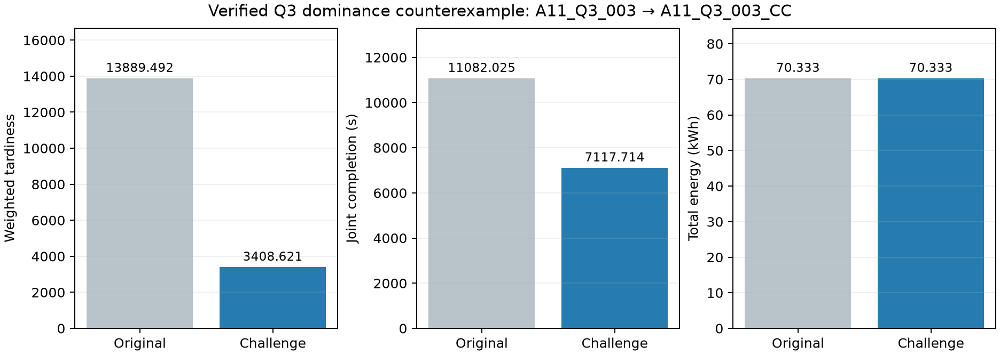
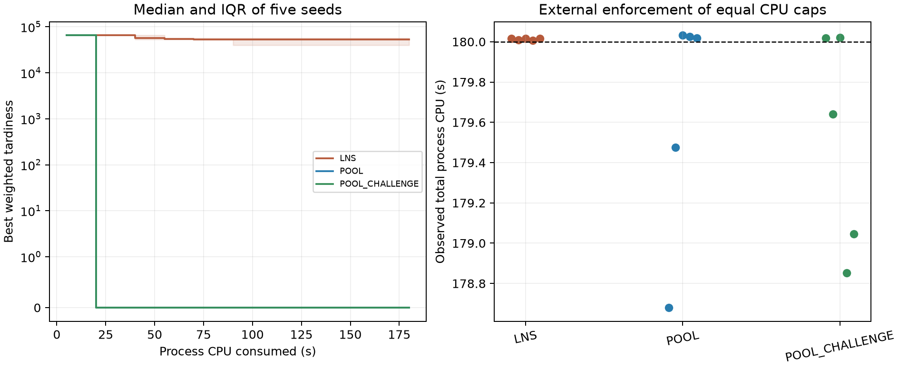

# 地形约束下无人机应急配送、中继保障与独立任务分区

> 正文工作稿。基础模型、Q1—Q4主结果及180秒CPU五种子实验均已对应验证证据。本文尚需与题目正式排版、参考文献和附录编号统一，不能把工作稿直接视为最终提交论文。

## 摘要

针对山区应急物资配送中地形、异构运输资源与通信保障相互耦合的问题，建立由运输模式生成、资源联合排程、通信任务构造和独立任务分区组成的模型。首先，以UTM平面直线定义飞行航段，在原生数字高程栅格上检查航迹相触像元，统一计算巡航高度、飞行时间和载荷相关能耗。其次，把货箱组合、机型和服务区访问次序表示为完整运输模式，在满足逐箱唯一交付、硬截止和无人机—电池容量约束下生成不同性能预算的可执行方案。对运输轨迹的直连不足区间构造中继任务，联合安排中继飞行、建链、服务、返航、周转和能源组件充电。为避免直接接受有限档案中的非支配点，进一步主动寻找同时不劣且至少一项改进的支配反例，并独立复核所得执行包。

在本题80箱、15个服务区实例中，单点组批得到18个运输架次。自主运输方案能够以19架次、60.048 kWh实现零加权迟到；引入通信后，选定的自主联合主例以25个运输架次和5个中继架次，在原有两架中继与六个能源组件下保持零迟到，联合完工时间为7191.58 s，总能耗为70.464 kWh。21个联合执行包通过独立数值验证，主动挑战找到7个经复核的支配反例，最终有限档案保留14个非支配点。基于主例的完整任务依赖，两个、三个独立任务组分别枚举31、90种合法分区，最低分类型库存缺口为2、4件。结果表明，运输层面的少架次、低能耗优势不保证加入通信保障后仍保持零迟到；分区时还须区分共享资源总量与各类型的独立峰值需求。

关键词：无人机应急配送；异构资源；通信保障；模式生成；主动支配挑战；独立分区

## 1 问题分析与模型层次

运输方案既决定送达时间，也决定无人机经过何处、何时需要中继。因此，不能仅在获得一条运输路线后检查某些时刻是否有可用中继站点，还需判断中继机能否按时到站、完成建链、持续保障并在返航充电后投入后续任务。问题四又要求各组独立配置资源，原方案中跨组的时间复用收益不能自动保留。

本文依次建立四层模型：统一地形—能耗—资源基础模型；单点组批与多点运输模式的联合排程；通信需求生成与运输—中继协同排程；保持完整任务依赖的独立分区。依赖驱动重构允许修改局部运输结构，主动支配挑战用于检查已有候选是否仍存在可同时改进的方案。二者是求解机制，不替代基础物理与资源约束。

下文严格区分三类结论：方案独立验证说明给定执行包满足检查口径；档案非支配说明当前已验证集合内部互不支配；全局非支配需要额外优化证明。本文的联合方案结果属于前两类。

## 2 统一地形、能耗与资源基础模型

### 2.1 航段几何与飞行时间

令节点平面位置为 \(\boldsymbol r_i\)，采用UTM 49N投影中的线段

\[
\boldsymbol r_{ij}(\lambda)=(1-\lambda)\boldsymbol r_i+\lambda\boldsymbol r_j,
\qquad 0\le\lambda\le1.
\]

将其反投影至原生DEM坐标，求与栅格边界的交点并检查所有相触像元。线段沿边界时检查两侧，经过角点时检查四邻域，不对DEM重采样，也不另加半像元偏移。运输巡航高度取沿段最大地面高程加50 m；中继段还须不低于两端作业高度。缺测、出界或非有限飞行地形值按拒绝处理。

设航段水平距离为 \(d_{ij}\)，爬升、下降高度为 \(h^+_{ij},h^-_{ij}\)，机型为 \(g\)，则

\[
t_{gij}=\frac{h^+_{ij}}{v_g^{\uparrow}}
+\frac{d_{ij}}{v_g^{\mathrm{cr}}}
+\frac{h^-_{ij}}{v_g^{\downarrow}}.
\]

装载与交接时间按固定项和箱数项计算。任务“开始”指准备装载开始，“交付”指交接完成；二者均不等同于起飞或抵达时刻。

### 2.2 运输能耗、返航余量与充电

对载荷 \(q\)，题给等效航程为

\[
L_g(q)=L_g^0-(L_g^0-L_g^F)(q/Q_g)^{3/2}.
\]

由单位等效航程消耗电池能量的解释，水平能耗写为 \(E_g^{\mathrm{bat}}d_{ij}/L_g(q)\)。以重力势能和爬升效率刻画附加爬升消耗，采用

\[
E_{gij}(q)=E_g^{\mathrm{bat}}\frac{d_{ij}}{L_g(q)}
+\frac{(m_g^0+q)g_0h^+_{ij}}{\eta_g^{\uparrow}\,3.6\times10^6}.
\]

后一项是本文采用并冻结的物理建模选择，不将其写成题面直接印出的公式。附件下降能耗取零。每次交付后更新载荷，返场段为空载；不能用起飞载荷计算全部航段。

完整架次满足质量、体积及返航余量约束

\[
q\le Q_g,\quad V\le V_g,\quad E_p\le(1-\rho)E_g^{\mathrm{bat}},\qquad\rho=0.2.
\]

返航电量比例为 \(s=1-E_p/E_g^{\mathrm{bat}}\)。按题给两阶段充电关系，充满所需时间为

\[
t_{\mathrm{chg}}(s)=t_{\mathrm{full}}
\begin{cases}
0.65(0.90-s)/0.90+0.35,&s<0.90,\\
0.35(1-s)/0.10,&s\ge0.90.
\end{cases}
\]

运输无人机占用区间为准备开始至返航；同型电池占用区间为起飞至返航后充满。两种资源分别分配，不把一块电池永久绑定给一架无人机。

### 2.3 时效评价与硬截止

医疗物资及首批物资满足对应硬截止，两者同时适用时取较早者。普通物资期望时间保留为软目标。定义

\[
J_{\mathrm{late}}=\sum_b w_b(t_b-D_b)_+,
\qquad
J_{\mathrm{norm}}=\frac{\sum_b w_bt_b/D_b}{\sum_b w_b}.
\]

时效使用 \((J_{\mathrm{late}},J_{\mathrm{norm}})\) 字典序：先减少加权迟到，仅在主指标相同时比较整体交付早晚。它与完工时间、总能耗和架次数共同构成多目标评价，不用固定加权和替代题目不同性能维度。

## 3 单点组批与异构运输资源联合优化

### 3.1 问题一：单点组批

对每个服务区枚举货箱子集及三种机型，逐一计算载荷、体积、完整往返能耗和作业时长。剔除不可行子集后，以集合划分动态规划按“架次数最少—总能耗最小—总作业时长最短”的优先次序求解。不同服务区之间不合并货箱。最大安全载荷另通过单调能耗边界与质量上限确定。

所得18架次覆盖80箱且每箱一次，总能耗59.130796 kWh，架次作业时长合计32776.092677 s。这里的时长合计包含准备、装载、飞行与交接，不能解释为多机并行执行的完工时间。独立程序重算全部架次物理量及45个“机型—服务区”安全载荷边界。

### 3.2 问题二：运输模式与时间索引联合选择

一个运输模式 \(p\) 指定货箱组合、机型、服务区次序、各箱交付偏移、作业时长、能耗及电池充电时间。非线性载荷能耗在模式给定后成为常量，联合排程不需要改变原物理公式。

令 \(x_{p\tau}\) 为模式 \(p\) 在时间 \(\tau\) 启动的选择变量。按具体箱号表示时，逐箱约束为

\[
\sum_{p,\tau}a_{bp}x_{p\tau}=1,\qquad\forall b.
\]

实现中仅把服务区、质量、体积、硬截止、期望截止及权重完全相同的箱子压缩为等价类，最后展开回具体箱号。同型资源在任一时刻满足

\[
\sum_{p,\tau:g(p)=g}\mathbf1\{t\in I^U_{p\tau}\}x_{p\tau}\le n_g^U,
\quad
\sum_{p,\tau:g(p)=g}\mathbf1\{t\in I^B_{p\tau}\}x_{p\tau}\le n_g^B.
\]

先用保守时间格点生成种子，再为实际区间分配机号和电池，按已选资源次序连续左移，并复核全部约束。120/180 s 是搜索开始时刻网格，不能当作通信验证步长。零迟到分支扫描绝对完工预算，软迟到低能耗分支单独保留。

自主模式生成从本地数据出发，不导入外部箱组。完整单点物理枚举有1074个模式，经有界选择保留296个，并增加2607个两点模式，共2903个。两点候选覆盖所选相邻服务区组合的三种机型及双向次序，但不代表全部多点路线。求解器界与间隙仅适用于当次声明的模式池及时间域。

|自主方案|加权迟到|辅助交付指标|完工/s|能耗/kWh|架次数|
|---|---:|---:|---:|---:|---:|
|A11|0|0.492136|6412.642|67.390|25|
|A12|0|0.507780|6953.489|66.192|24|
|A03|0|0.555276|8844.595|60.048|19|
|AS01|286441.051|0.661300|9946.244|58.675|18|

上述每行对应完整执行方案，不能跨行拼接指标。A03体现少架次和低能耗，A11体现较短完工；两者在运输层已经存在权衡。AS01进一步降低架次和能耗，但付出明显软迟到代价。

## 4 通信需求生成与运输—中继协同优化

### 4.1 由三维轨迹生成通信任务

按题给链路预算，双向链路可承受损耗取两个方向的较小值，链路余量为

\[
M_C=L_{\max}-[32.45+20\log_{10}f_{\mathrm{MHz}}+20\log_{10}D_{\mathrm{km}}+L_{\mathrm{obs}}b].
\]

\(b\) 为冻结无线视距模型的地形遮挡指示。无线遮挡与飞行航高的地形穿格是两个不同计算问题，本文未将更换飞行地形算法解释为更换无线模型。

对运输机从起飞至返场的完整三维轨迹，计算直连 \(M_C(t)<0\) 的区间；覆盖爬升、巡航、下降、交接和返程。直连可用时可直接接入地面站，否则只能通过一架中继完成“运输机—中继—地面站”双跳，禁止中继之间多跳。候选中继站需同时满足接入链路和回传链路要求。

通信任务构造采用0.5 s采样、边界细化及2 s保障扩展；最终独立验证重新检查全航程，代表方案加密至0.25 s。对固定相对轨迹，在静态地形下改变绝对开始时刻只使通信区间平移，因而可缓存相对模板；箱组、访问次序、机型、阶段时间、几何或无线代码改变时重新计算。

### 4.2 中继架次与四类资源闭环

一个中继架次包括准备、出航、建链、若干保障区间、区间间空闲悬停、返航、周转与组件充电。若保障区间的并集时长为 \(a\)，首末保障跨度为 \(s\)，中继能耗为

\[
E_R=E_R^{\mathrm{flight}}+E_R^{\mathrm{setup}}
+(P_{\mathrm{hover}}+P_{\mathrm{comm}})a/3600
+P_{\mathrm{hover}}(s-a)/3600.
\]

不能把并集时长与首末跨度混为一谈，也不能把空闲悬停全部按通信功耗收费。中继机占用至返航并完成周转，能源组件占用至返航充满；分别核对两架中继和六个能源组件容量。通信上存在可用站点，仅是联合可执行的必要组成，不能代替整个资源日历的可行性。

运输开始时刻与资源分配随中继安排联合调整，并重新核验硬截止。对实际共享中继的运输任务，还允许局部释放货箱归属、机型和访问次序，再生成通信任务及中继安排。一次结构重构已产生独立验证的完整见证，但没有支配选定主例，因此本文不据此声称重构机制带来显著性能优势。

### 4.3 主动寻找支配反例

有限档案的非支配筛选无法排除档案外的更好方案。对候选 \(x\)，在声明的局部域 \(\mathcal X_C\) 中主动寻找 \(y\)，要求各准则不劣且至少一项严格改进。时效涉及字典序时，分开考虑迟到严格减少以及迟到相同、辅助交付改善的情况。

原点是否包含在挑战域内必须核验。例如，以全保障跨度乘通信功率的保守能耗上界会排除部分原方案，不能据此宣布它们已被充分挑战。为此进一步固定通信端点先后关系；在该连续时间域内，保障区间并集长度为仿射式，可精确区分活动通信和空闲悬停能耗。该域保留原点，但仍限制运输结构、站点和部分顺序，且资源冲突搜索有计算预算。

本轮对14个源候选进行40次此类尝试，得到7个经独立验证的支配反例。例如，A11_Q3_003 的改进方案把联合完工时间降至约7117.71 s，同时减少迟到且不增加总能耗。其本身仍有软迟到，因此不替换零迟到主例。最终21个已验证执行包中，合并档案保留14个非支配点；其中自主线8个，外部对照线6个。对照结果独立标注来源，不作为自主生成能力的产物。

### 4.4 联合主例与运输层对照

|方案|加权迟到|联合完工/s|总能耗/kWh|运输/中继架次|
|---|---:|---:|---:|---:|
|A03_Q3_001|43657.352|9617.668|64.438|19/7|
|A11_Q3_001|0|7191.582|70.464|25/5|

选定自主A11_Q3_001为标准场景主例，其 \(J_{\mathrm{norm}}=0.467343499\)。在原库存约束下，0.25 s独立全航程复核检查134896个样本，未发现未覆盖样本，最小双跳余量约0.149557 dB。

A03在运输层以更少架次、更低能耗实现零迟到，但对应联合见证出现迟到，并需要更多中继架次。这说明运输层的低成本优势不保证加入通信后仍保持零迟到。由于A03与A11原本已经存在运输时间—能耗权衡，不能仅据此宣称全部目标排序发生逆转，也不能宣称A03结构在所有可能联合调度下必然迟到。

## 5 保持任务依赖的独立分区

### 5.1 不可拆依赖块

问题四固定A11_Q3_001的任务、时刻和保障关系，允许把原资源编号重新分配为组内专用资源。同一运输架次访问的服务区必须同组；一个完整中继架次保障的所有运输架次也必须同组。该口径不复制、不切开现有中继架次。

依赖超图得到六个不可拆块：

\[
\{S001\},\quad
\{S002,S003,S005,S007,S008,S009,S013,S015\},\quad
\{S004\},\quad\{S006\},\quad
\{S010,S012,S014\},\quad\{S011\}.
\]

将六块划分为两个、三个非空无标号组，分别有 \(S(6,2)=31\)、\(S(6,3)=90\) 种。本文完整枚举这些分区。

### 5.2 分类型最小资源与工作量均衡

组内同类资源数量等于对应占用区间的最大重叠数：同时重叠任务给出必要下界，区间着色构造达到下界的资源日历。因此，各组需求先按A/B/C运输机、A/B/C电池、中继机、组件八种类型求出，再分别相加，与库存逐类型比较。

工作量取运输机准备至返航与中继机准备至周转结束的占用时长之和；均衡指标为各组工作量的总体变异系数 \(CV=\sigma(W)/\overline W\)。完整分区前沿使用八维需求和CV。为便于选取提交代表，另外给出缺口件数优先与均衡优先两种选择；件数不解释为设备采购货币成本。

|分组数|选择规则|总资源件数|新增缺口件数|工作量CV|
|---|---|---:|---:|---:|
|2|缺口优先|29|2|0.822257|
|3|缺口优先|31|4|1.106806|
|2|均衡优先|38|11|0.208811|
|3|均衡优先|42|14|0.575542|

缺口优先两组需要新增A型运输机1架、B型运输机1架；三组在此基础上再增加C型运输机1架及C型电池1组。均衡改善需要更多独立资源，不能只报告最低缺口而把其称为不附带偏好的唯一最优方案。此处最小性只适用于固定执行时刻和完整中继依赖口径，不推广至允许重调度或拆分中继任务的另一问题。

## 6 等算力多种子实验

<!-- ABLATION_BEGIN -->
本节仅比较三个具体Q2实现：修正后的uniform LNS、模式池加联合整数调度、模式池加主动支配挑战。每法5个种子，统一180秒单核进程CPU上限。初始数据表、几何、评价、资源和共同B0生成规则一致，不导入现成解；数据读取、模式生成、建模、求解和结果导出计入预算，公共几何预处理及独立验证不计入。方法按种子轮换物理核心，只有截止前完整保存且经独立验证的执行包参与统计。

| 方法 | 最好Jlate | 每种子最好Jlate中位数 | 最好完工/s | 最低能耗/kWh | 非支配点数中位数 | 零迟到成功率 |
|---|---|---|---|---|---|---|
| LNS | 32492.966 | 52861.288 | 10046.345 | 85.664 | 2.0 | 0% |
| POOL | 0.000 | 0.000 | 6396.935 | 60.427 | 2.0 | 100% |
| POOL_CHALLENGE | 0.000 | 0.000 | 6396.935 | 60.427 | 2.0 | 100% |

最好完工与最低能耗分别取独立极值，不能合成为一条方案。非支配点数为每种子去重后有限档案点数的中位数。由于三法共同重新生成可行B0，同时报告零迟到成功率，避免把初始化已有可行解误当作优化能力。

模式法与增强法分别在5/5、5/5个种子中达到零迟到；uniform LNS为0/5。本结果反映本实现、实例和预算下的差异，不代表对全部元启发式方法的优劣判断。增强法在本轮另找到13个经过独立验证的Q2支配见证；这与先前7个Q3反例是两套独立统计。主动挑战会占用原本可用于模式生成的预算，因此不能仅凭反例数量推断整体前沿一定更好。

配对有限档案比较另记录每个种子中两法的相互支配覆盖，全部原始结果、逐种子表和计时记录随文保留。不声称本次Q2实验验证了Q3同步结构重构的性能优势，也不据五个种子推导多实例或全局最优结论。

同预算下，两种模式方法在全部五个种子达到零迟到，uniform LNS未达到。增强法相对普通模式法的最好完工差仅约0.000030秒，最低能耗相同到本表精度，不应放大这一时间尾差。其每种子最好Jnorm中位数由0.477080降至0.467268；在同种子档案配对中，增强法支配普通模式法累计11个档案点中的10个，反向为0个。点数是五次有限档案的累计，并非独立测试实例数量。当前证据支持本实现的预算效率和辅助交付改善，不支持全指标或全问题的普遍优势。

计时校准中第一版监控读数与备用CPU限制触发不一致，整批作废；修正后全部15次从头重跑，未根据结果选择种子或延长某法预算。正式计时采用与子进程相同的POSIX进程CPU时钟，最大观测误差控制在0.2秒内。

<!-- ABLATION_END -->

## 7 独立验证、局限与结果一致性

几何生成器与第二套行带裁剪/二分求根实现对240条有向运输航段交叉核验。Q2按实际箱号、逐段能耗、载荷、硬截止、机号、电池、返航SOC及充电日历独立重算。Q3另核验双跳链路、中继活动/空闲时长、返航、周转和组件占用，并重新采样运输全航程。Q4用图遍历、全标号分区枚举和事件扫描复核资源最小需求；输出日历与源任务逐字段比较。

提交工作簿的Q2运输页与Q3中继页不能直接配对，因为联合优化改变了运输时刻。为此附加Q3运输时刻及逐箱交付页，并对官方六页、补充页、通信区间覆盖及输入哈希独立检查。

本文存在三项明确边界。第一，模式池、多点路线和局部搜索域有限，整数模型的界不自动成为原问题全局界。第二，通信验证是带边界细化的全航程数值采样，不能宣称解析连续时间证明。第三，标准场景仅要求额外通信余量为零，旧结构的鲁棒余量认证不转移至新主例。本文不以未找到某个高余量见证断言系统物理不可行。

## 8 结论

统一几何下，自主运输模式能够生成有竞争力的完整配送方案，并能在通信与四类资源共同约束下形成独立验证的联合主例。少架次、低能耗的运输优势与联合时效并非同一目标；完整任务与通信依赖又使分组资源需求呈现明显的类型差异。主动支配挑战实际发现了有限档案外的改进方案，提高了已知执行方案的质量，但没有替代全局最优性证明。所给主例、独立分区和提交表使用一致的任务身份与时刻，构成可追溯的结果链。

## 工作稿的来源与编辑说明

公式依据为题目原文、附件参数及已明确标注的建模推导/选择；应在最终排版中与题目附件编号对应。本文没有把标准整数规划、区间着色或已有搜索术语宣称为学术首次提出。正式参考文献、相关研究定位与比赛排版仍需最后整合，不把仓库内部文档冒充公开学术文献。

模型与数值对应：[G2完整报告](../../results/reset/RESET_REPORT.md)、[新Q4](../../results/reset/q4/Q4_REPORT.md)、[提交一致性](../../results/reset/submission/validation.json)。本正文不按开发阶段编号叙述。
