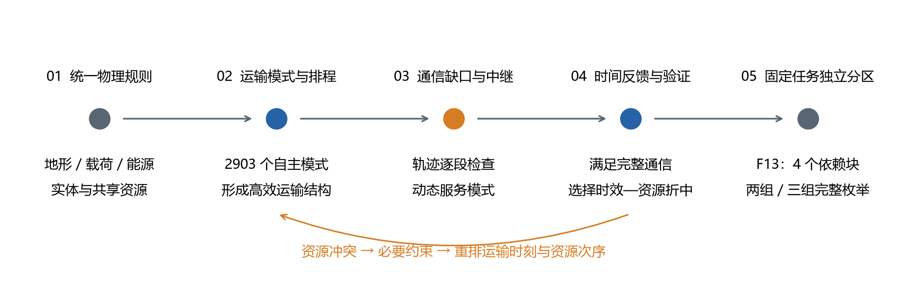
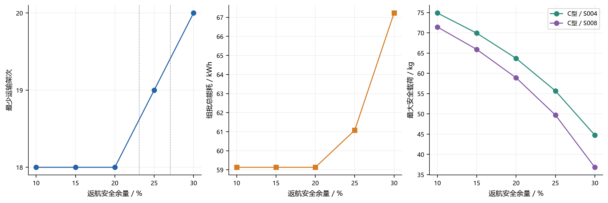
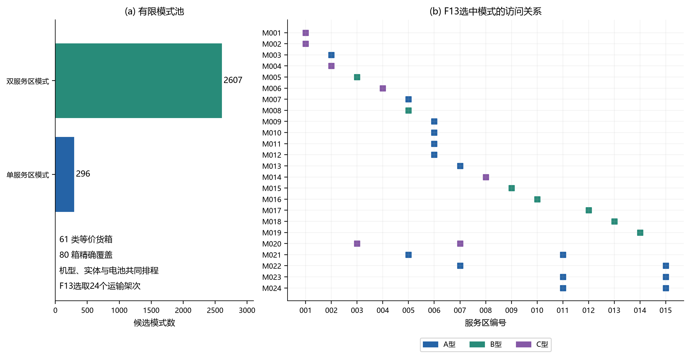
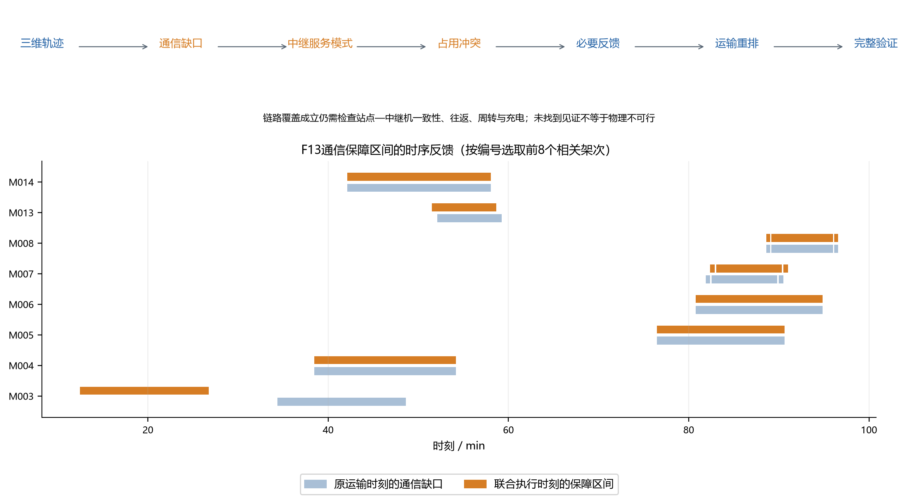

# 山区应急物资配送中运输效率主导的运输—中继分解协调与独立任务分区

## 摘要

山区灾后物资配送同时受到地形净空、异构机型、有限电池和通信覆盖的限制。仅优化运输路线，可能得到无法持续通信或不能按时周转的计划；预先采用过强的通信限制，又可能损失运输效率。针对15个服务区、80箱物资的运输与通信协同任务，本文建立统一地形、动态载荷能耗和共享资源模型，采用运输效率主导的分解协调方法：先从自主生成的2903个运输模式中构造运输结构，再沿三维轨迹提取通信缺口，动态生成中继服务模式，并将中继占用冲突反馈到运输时序和资源次序。经独立物理、资源和数值全航程通信核验，阶段性主例F13实现零迟到，联合完工时间为@@F13_MIN@@ min，总能耗为@@F13_ENERGY@@ kWh，使用24次运输和3次中继。与本文近快端代表F12相比，F13增加@@DT12@@ s，减少2次运输并节省@@DE12@@ kWh；低资源代表则展示进一步节能所需的时间代价。单点运输敏感性分析表明，返航剩余电量要求从10%提高至20%时最少架次数保持18次，在25%和30%时分别增至19次和20次，其变化来自特定服务区整批运输可行性的丧失。固定F13执行方案形成4个不可拆任务块，完整枚举两组、三组分区后，最小资源缺口分别为4件和10件；改善组间均衡需要增加资源配置。研究表明，将通信冲突转化为运输排程反馈，能够在保持运输结构多样性的同时形成可核验的联合执行方案。结果的最优性声明限于明确给定的单点组合或固定分区域，联合方案仅代表有限已验证档案中的已知折中。

**关键词：** 应急物流；异构无人机；通信中继；动态服务模式；共享电池；独立任务分区

## 1 引言

山区洪涝灾害可能同时阻断地面交通与常规通信。首轮救援既要把不同类别的物资送至需求点，也要保持执行运输任务的无人机与指挥端之间的联系。无人机为最后一程应急配送提供了机动能力，但载荷和能源限制使一次运输能覆盖的需求有限[1]。本题进一步给出了地形、货箱、机型、时间窗口和通信装备等数据[11]，要求将路线选择与可用资源落实为同一执行计划。

困难首先来自约束之间的耦合。跨越山脊需要爬升，携带更多货箱改变平飞与爬升能耗；卸货后的返航载荷又与出航不同。完成一次运输并不意味着同一电池可立即承担下一次运输。更关键的是，某条轨迹存在满足链路预算的中继站点，并不意味着有限的中继无人机能及时到达、持续保障并完成往返与周转。因此，链路可覆盖、任务可保障和资源可执行是三个需要分别核验的层次。

单独求解运输再做一次通信检查，不能消除运输时刻与中继占用之间的冲突。反过来，若在生成运输结构时直接排除所有暂时难以保障的任务，也会缩小高效运输的选择范围。本文需要的能力是保留有价值的运输结构，并把通信层发现的具体冲突返回运输排程，而不是仅接受或否决整套计划。

为此，本文采用运输效率主导的运输—中继分解协调方法。其贡献包括：第一，统一地形、动态载荷能耗、电池充电和实体资源占用，保证运输模式可进入实际排程；第二，将三维轨迹上的通信缺口转化为中继服务任务，通过动态模式生成和必要反馈约束协调两类飞行任务；第三，对联合方案进行独立核验，并在固定主例上完整求解保持依赖关系的分区问题。近快端比较用于解释主例选择，安全余量敏感性用于解释物理约束引起的离散变化，二者均不承担未被证明的全局性能结论。

图1 由运输模式、轨迹通信需求到独立分区的统一证据链。反馈仅调整允许变化的运输时序与资源次序；分区阶段固定主例的执行任务。

## 2 相关方法与本文位置

### 2.1 应急物流与异构运力

应急无人机配送模型能够把物资需求、飞行能力和能源限制纳入物流决策[1]；异构车辆路径研究则提供了同时选择运力类型与服务路线的基本框架[2]。这些方法说明了机型选择应与需求组合共同决策。本题还要求处理山区爬升、卸货后的载荷变化、有限电池及通信中继，因此不能只依据水平距离或名义载重评价一个运输模式。

### 2.2 模式选择、邻域搜索与充电排程

以完整可行路线或服务模式为列，再用整数变量选择组合，是车辆配送整数规划的经典思路[5]。它便于在候选层处理复杂物理限制，在调度层处理覆盖和资源关系。大邻域搜索则通过破坏与修复现有解探索结构变化；自适应大邻域搜索还依据历史表现更新算子选择[4]。本文的核心是模式选择与资源排程的接口，不以某个邻域算法名称替代协同机制，也不据此声称算法性能优于其他方法。

充电过程会改变资源何时重新可用，非线性充电研究说明将充电简化为常数可能影响路径和调度的可行性[3]。本文采用题面给出的分段充电规则，分别建立无人机和电池日历。文献提供方法背景，具体充电参数来自本题，而非从其他应用移植。

### 2.3 空中中继与逻辑反馈

空中平台的位置与运动会改变通信覆盖，因而通信设计与轨迹规划天然相关[7]。本文在规定的无线预算下判断两跳中继链路，并进一步计算中继往返、悬停、设备准备和资源周转。逻辑分解方法通过子问题推导的信息改进主问题[6]，为这种反馈思路提供了方法依据。但本文采用的模式生成与反馈尚不具备完整定价或穷尽割生成，因此不将其称为完整列生成或具有全局收敛保证的分解算法。

### 2.4 多目标折中与固定任务资源配置

ε约束方法通过给部分性能指标设置预算，考察其他指标的变化[9]。本文以联合完工时间预算研究零迟到条件下的运输架次与能耗，只报告实际找到并核验的离散方案。固定任务区间上的最少同类资源数则等于区间最大重叠深度，可通过区间分配获得[10]。该性质用于计算独立分区的资源需求，不意味着运输结构或所有可能的分区建模方式都已达到全局最优。

## 3 问题定义、数据与评价口径

研究对象包括一个起降与指挥基地、15个服务区和80箱不可拆分货物。运输机A、B、C分别有4、2、2架，对应电池分别有6、4、4块；另有2架中继无人机和6个中继能源组件。货箱的质量、体积、目的地、物资类别与时间要求，以及机型和无线参数，均使用官方附件[11]。一个运输架次可以按选定访问顺序服务一个或多个区域，卸货后更新载荷，最终返回基地。中继架次同样包含出航、设站、保障与返航。

本文区分三种约束来源。净空、载荷、库存和给定时间要求属于题目规则；对同一中继架次覆盖的任务保持不可拆依赖，是独立分区采用的固定任务解释；时间离散化和通信采样属于数值实现。后两类均在相应章节说明适用范围，避免将数值检查表述为连续域证明。

| 符号 | 含义与单位 |
|---|---|
| $q,Q_k$ | 当前载荷与机型额定载荷，kg |
| $B_k,\rho$ | 电池额定电量，kWh；要求保留的电量比例 |
| $t_b,d_b,w_b$ | 货箱交付时刻、规定时效参考及物资权重 |
| $\mathcal P,x_p$ | 运输模式集合及各模式使用次数 |
| $J_{\rm late},J_{\rm norm}$ | 迟到罚值与归一化交付时效 |
| $T_{\rm joint},E_{\rm total}$ | 联合完工时间，s；运输与中继总能耗，kWh |
| $N_T,N_R$ | 运输架次数、中继架次数 |
| $M_C$ | 链路预算相对于规定门限的余量，dB |
| $n_{kr},D_r$ | 第$k$组对$r$类资源的峰值需求及全组库存缺口 |

交付及时性与最后返航时间承担不同功能。前者反映物资送达过程，后者反映整项飞行任务何时结束。本文采用

$$J_{\rm late}=\sum_b w_b\max(0,t_b-d_b),\qquad
J_{\rm norm}=\frac{\sum_b w_b t_b/d_b}{\sum_b w_b}.$$

医疗等硬截止和首批到达要求另行作为可行性约束，不能用有限罚值替代。满足安全、资源、通信和硬截止后，优先实现零迟到，再分析交付时效、联合完工、总能耗与两类架次的权衡。运输架次与中继架次分别保留，不能以二者之和替换支配关系。

联合完工定义为所有运输和中继飞行返回基地时刻的最大值。返航后的充电和周转继续计入资源日历，但不计入本次联合飞行完工指标。问题一中的累计作业时长为各单点架次时长之和，也不能与并行执行后的完工时间混同。

## 4 地形、载荷、能源与资源的统一模型

### 4.1 以统一几何确定航段高度和时间

山区航段必须先满足地形净空，随后才能计算爬升和航行。本文在UTM 49N平面坐标中连接航段端点，并用原生DEM的supercover穿格方法取沿线经过栅格的最高高程。巡航高度由沿线最高地形加规定的50 m净空确定，并满足端点高度要求。路径几何与无线视距检查各自使用冻结规则，不能以路径最高高程计算替代无线射线遮挡判断。

对由爬升、平飞和下降组成的航段，飞行时间为

$$\tau_{ij,k}=h^+_{ij}/v^+_k+d_{ij}/v_k+h^-_{ij}/v^-_k.$$

服务、装货、准备等时间另按相应规则计入任务时序。该模型没有把倾斜直线距离直接除以巡航速度，而是保留垂直运动的时间代价。

### 4.2 动态载荷下的能量约束

为区分重载出航与卸货后的返航，先用当前载荷$q$计算有效平飞航程：

$$R_k(q)=R_{k,0}-(R_{k,0}-R_{k,F})(q/Q_k)^{1.5}.$$

单段平飞与爬升能耗分别为

$$E^{\rm cr}_{ij,k}=B_k\frac{d_{ij}}{R_k(q)},\qquad
E^{\rm up}_{ij,k}=\frac{(m_k+q)g h^+_{ij}}{\eta_k\,3.6\times10^6}.$$

每次卸货后更新$q$；末段采用返航载荷。下降不计能量回收。任务总能耗满足$E\le(1-\rho)B_k$，并同时满足额定质量、体积限制。基准采用$\rho=0.20$。这使“名义载荷装得下”与“能安全返航”成为不同的判据。

### 4.3 通过独立日历落实实体资源

同一架无人机的任务区间不得重叠，同一块电池也不能在尚未充满时再次使用。记返航后的荷电比例为$u$，规定充满时间为$T_k^{\rm ch}$，采用

$$t_k^{\rm ch}(u)=T_k^{\rm ch}\begin{cases}
0.65(0.9-u)/0.9+0.35,&u<0.9,\\
0.35(1-u)/0.1,&u\ge0.9.
\end{cases}$$

运输无人机占用区间从准备开始至返航结束；运输电池从起飞至充电完成。中继无人机从准备开始至返航后的周转结束，中继能源组件从起飞至充电完成。分开建立这四类日历，使“飞行结束”和“资源可再次投入”具有明确区别。分段充电的重要性与相关资源调度研究一致[3]，公式中的分段比例和时长由本题给定。

### 4.4 通信预算与两跳保障

首先计算自由空间损耗，其频率以MHz、距离以km计时采用[8]

$$L_{\rm FS}=32.45+20\log_{10}f+20\log_{10}d.$$

题设无线模型在此基础上计入天线增益、系统损耗以及地形遮挡附加项。本文保留2400 MHz频率、3 dB系统损耗、10 dB地形遮挡附加损耗、−98 dBm接收灵敏度和8 dB规定衰落余量；这些具体参数来自题目，不由自由空间标准本身推出。链路按双向中较弱方向判定。直连不足时，运输机—中继机以及中继机—基地两跳必须同时满足$M_C\ge0$。本文主例不叠加额外通信鲁棒余量，也不把确定性预算检查解释为真实信道扰动下的保障概率。

图2 地形净空、动态载荷与能量预算的关系。左图仅为几何示意，不表示实测剖面；右图由S004的实际G2航段和机型参数计算，横轴为载荷，虚线为20%返航余量下的能源预算。

## 5 问题一：单点组批与安全余量敏感性

### 5.1 完整单点组合求解

问题一先回答每类机型在各服务区能安全运送多大载荷，再回答不可拆货箱应如何分批。对每个服务区$s$和机型$k$，最大安全载荷定义为满足往返能量与机型质量上限的最大$q$；实际货箱组合还必须满足体积限制。枚举该区所有非空货箱子集，筛除物理不可行组合，再以已覆盖货箱集合为状态求解精确覆盖。

选择准则依次为最少架次数、在最少架次下最低能耗，以及相应实现中的累计作业时长。该单点组合域包含该服务区所有货箱子集和三类机型，不能据此推出多点路线或共享库存排程的全局结论。为核对实现，每一服务区与余量组合另建整数覆盖模型，分别求解最少架次和固定该架次后的最低能耗；这两个目标与原求解器一致。累计时长由所选方案重新计算，不另声称其独立整数规划最优性。

### 5.2 五档余量下的变化

固定当前G2几何及所有其他参数，仅改变返航剩余电量比例。每一档重新计算45个机型—服务区载荷上限、所有可行货箱组合及分批结果。汇总如下。

@@Q1_TABLE@@

表1 单点组批安全余量敏感性。累计时长为各架次作业时长之和，不是多机并行完工时间；A/B/C为所选机型架次数。

10%至20%内最少架次数、所选组合、总能耗和累计时长均保持不变。这不是安全约束没有作用，而是这些档位仍允许同一组离散货箱组合。连续变化的载荷上限只有跨过某个完整组合的需求时，才会改变组批结构。

### 5.3 阶跃来自哪些服务区

第一个架次数变化发生在S004。其6箱整批使用C型机时，对应最大可保留电量比例约为@@CRITICAL4@@%；边界等号仍满足能量约束，再提高余量则需要拆为两次运输。因此，25%档相对于20%档增加一次运输。第二个变化发生在S008，其5箱整批的对应比例约为@@CRITICAL8@@%，使30%档再增加一次运输。这些临界比例由完整单点组合的能量阈值定位，并在边界及其上方重新计算。

此外，25%至30%时，S002和S003虽仍各需两次运输，却从B、C混合配置转为两次C型运输，并重新分配箱组。这解释了为什么能耗增幅并不只由新增架次数决定。30%档相对20%档总能耗增加@@Q1_ENERGY_INCREASE@@ kWh，累计作业时长增加@@Q1_TIME_INCREASE@@ s。

图8 五档返航电量要求对应的架次数、能耗和关键服务区安全载荷。连线用于展示所测档位；竖虚线标出单点组合域中的架次数变化阈值，不将五档结果外推为连续调度性能曲线。

本轮核验覆盖225个载荷上限、五档各80箱精确覆盖，以及75组单点整数规划证书；基准20%档与当前G2问题一结果一致。该敏感性仅属于问题一，不改变F13的问题二、三执行计划。

## 6 问题二：运输模式生成与异构资源排程

### 6.1 把物理可行性封装为运输模式

一个运输模式包含箱组、服务区访问顺序和机型。按目的地、物资属性等对货箱归类后，共形成61个等价需求类别。自主模式池包含2903个模式，其中296个为单点模式、2607个为多点模式。每个模式均预计算载荷变化、各航段时间与能耗。这个有限池为求解提供结构选择，但不代表穷尽所有可能访问路线。

设模式$p$消耗第$c$类货箱$a_{cp}$个，该类需求为$n_c$。模式选择满足

$$\sum_{p\in\mathcal P}a_{cp}x_p=n_c,\qquad x_p\in\mathbb Z_{\ge0}.$$

同类实体货箱随后回填到具体任务，检查全部80箱恰好交付一次。模式使用整数次数，允许同一模式在不同实体资源上重复执行，而不是错误地将其限制为只能使用一次。

### 6.2 结构选择必须落到无人机和电池

选出的模式进一步分配至具体无人机和电池，并决定准备、起飞、卸货和返航时刻。调度模型连接货箱交付时刻与访问顺序，在硬截止、机型库存和两类资源不重叠约束下生成计划。时间离散化采用保守处理，候选输出后再按连续物理公式重算。离散调度模型的求解边界不能直接当作原连续问题的下界。

图3 自主运输模式池及F13实际选择。右侧为24个运输架次与15个服务区的访问关联，颜色区分机型；模式选择与实体资源日历共同形成可执行运输计划。

### 6.3 有限域界与正式结果口径

对固定箱组、访问顺序和机型的F13结构，可由各类无人机承担的不可重叠工作量构造完工下界。该下界为@@LB_F13@@ s，F13实际运输完工为@@TT_F13@@ s，包含中继后的联合完工为@@TJ_F13@@ s。下界只约束该固定结构；它既不覆盖其他运输结构，也不证明整个2903模式池或原问题的最优性。

不同自主结构为通信协同提供不同的时间和能源条件。本文保留近快端F12、F16，24次运输代表F13、F18，以及低资源代表C01，以考察结构选择的后果。正式主例的问题二表格采用F13在通信协调之后的实际运输时刻，其运输能耗为@@ET_F13@@ kWh，不能把协调前的出发时刻与协调后的中继计划拼接。选择这种统一口径是为了使问题二运输表能够直接进入问题三和问题四，不表示该运输时刻单独最优。

## 7 问题三：运输效率主导的运输—中继分解协调

### 7.1 将轨迹上的通信缺口转化为任务

从运输结构和当前时刻生成三维位置轨迹，在每个阶段检查直连预算。将直连不满足规定门限的连续区间提取为通信需求，并记录运输架次、相对时间、端点位置及可能服务站点。需求提取采用时间采样、边界细化和保护区间，候选生成参数与最终核验参数分别记录，避免将离散需求覆盖等同于全航程通过。

候选中继站点使用本项目自主生成并冻结的118个站点。每个新运输结构均重新判定任务—站点可服务关系，不能因结构标识相似而复用失效的通信任务。这里的站点池是有限搜索域，不是连续空间全部可行站点的枚举。

### 7.2 根据服务需求动态生成中继模式

中继服务模式描述一架中继机在一次出返航中，到某个站点保障哪些通信区间。将时间相邻且共享站点的任务尝试合并，计算实际服务区间的并集；间隙期仍需悬停，不应从能源计算中消失。中继能耗包括出返航、设站、主动通信悬停及间隙悬停。若主动服务时长和间隙时长分别为$D_a,D_i$，相应功率为$P_h,P_c$，则悬停和通信部分为

$$E^{\rm service}=\frac{(P_h+P_c)D_a+P_hD_i}{3600}.$$

每个模式还须满足返航电量、到站时间和两跳链路条件。模式之间通过具体中继机和能源组件连接，检查准备、返航、周转和充电区间。本文按当前任务与冲突动态添加服务模式，减少一次列举所有任务组合的负担；这一过程属于启发式动态生成，不具备完整定价，因此不称为精确列生成。

### 7.3 由中继占用冲突反馈运输时序

链路可行但排不出的典型原因，是多个早期需求分别要求不同站点，却争用两架中继机。仅累计通信保障时长不能发现这类冲突，因为出返航和周转也占用资源。协调过程因此保持箱组、访问顺序和机型，并允许运输开始时刻、无人机次序与电池次序改变，再重新提取通信需求。

反馈必须来自可解释的必要条件。例如，在每个中继架次只访问一个站点的建模域内，同一中继实体在同一站点可串联服务，而不同“中继机—站点”组合至少需要相应的出返航安排。当限制总中继架次时，使用的这类组合数量不能超过架次预算。该条件能够排除只在任务覆盖层面看似可行的选择，但本身不足以保证完整资源可执行，仍需返回中继排程与独立核验。

完整迭代为：运输排程生成轨迹，轨迹暴露通信需求，需求生成中继模式，中继冲突产生必要反馈，运输重排后重新计算需求。每次更新均保留实际物理区间和实体资源身份。图4同时给出机制与F13相关区间的实例，说明反馈改变的是任务发生时间，而不是通过省略通信需求获得可行性。

图4 通信缺口、中继模式、冲突反馈与运输重排。下部比较原运输时刻提取的需求区间与F13执行时刻下的保障区间；原需求带含构造保护量，二者不能作为未加解释的通信时长差直接相减。

### 7.4 完整执行核验

F13采用24次运输和3次中继，在运输无人机、电池、中继无人机、能源组件四类日历中均无资源冲突，80箱恰好交付一次，迟到罚值为零。通信核验独立于候选模式生成，沿实际完整飞行轨迹检查直连或有效中继链路，共核验@@SAMPLES@@个时空样本，采用0.5 s基础采样并对相关边界作0.1 s细化，未发现未保障样本。该结论是数值全航程核验，不是对任意连续时刻或随机信道扰动的解析证明。

图6 F13运输与中继的四类资源日历。充电区间及中继周转可能延伸至联合飞行完工之后，因此资源日历横轴比104.097 min更长并不构成指标矛盾。

## 8 零迟到条件下的近快端折中与主例选择

### 8.1 用时间预算解释资源代价

固定零迟到和完整通信要求，在由自主快速方案向外放宽的联合时间预算下，优先寻找更少运输架次及更低能耗的计划。ε约束提供清楚的解释：为节省资源，允许完工时间增加多少[9]。本文不将不同量纲任意合成一个“综合最优”分数，运输架次和中继架次保持独立。

@@TRADEOFF_TABLE@@

表2 自主已验证代表方案。所有方案均零迟到；F12、F16、F13和F18用于近快端比较，C01仅展示低资源端的角色，不替代F13的问题四或提交表。

图5 四个已验证方案的联合完工与总能耗，标注分别为运输及中继架次。点之间未绘制连续前沿，以免暗示未求出的中间方案。

### 8.2 为什么选择F13

从F12到F13，联合完工增加@@DT12@@ s，而运输架次从26降到24，总能耗下降@@DE12@@ kWh，约为@@PCT12@@%。F13的归一化交付时效也略低于F12，说明物资平均送达过程可以改善，即使最后一次返航稍晚。F16则位于两者之间，展示25次运输的一种可行选择。

从F13进一步移动到F18，联合完工增加@@DT18@@ s，总能耗再下降@@DE18@@ kWh，运输和中继架次均不再减少。在这组已观察到的近快端代表中，继续放宽时间带来的资源收益变小。因此，F13被选为运输效率优先条件下的阶段性主例，而非宣称存在唯一、普遍成立的最优折中。

低资源代表C01使用19次运输和4次中继，总能耗@@C01_ENERGY@@ kWh，但联合完工为@@C01_MIN@@ min。它说明减少运输架次不必然同时减少中继架次或提高救援完成速度。上述比较仅属于经过独立验证的有限方案档案及相应预算下的最好已知折中，不构成完整Pareto前沿，也不替代严格等算力、多种子的算法比较。

## 9 问题四：固定F13的依赖保持独立分区

### 9.1 从服务关系构造不可拆块

独立分区要求各组能够自行执行任务，资源不得跨组共享。为保持F13本身的执行含义，固定全部货箱、访问顺序、运输时刻、中继任务与中继时刻。多点运输涉及的服务区不能分开；同一中继架次保障的运输任务也保持在同一组。将这些关系表示为超边并求连通分量，得到下列4个不可拆块。

@@BLOCK_TABLE@@

表3 F13固定运输与中继依赖下的不可拆块。这里采用整架次保障关系保持的解释，未额外拆分中继任务。

对4个块分成非空两组或三组，消除组标签置换后，分别有7种和6种合法分区。本文完整枚举这些分区；完整性只属于该固定依赖域，不包含重新设计箱组、路线、中继任务或时刻后的分区。

### 9.2 各组独立资源需求与均衡指标

对分区中的每一组，保留全部任务占用区间，按资源类型计算同时在用的最大数量：

$$n_{kr}=\max_t\sum_{i\in\mathcal I_{kr}}\mathbf1\{t\in I_i\}.$$

采用左闭右开区间，使一个任务恰好结束时资源能够按既定规则转入下一任务。对于已包含周转和充电的同类固定区间，最大重叠深度既是资源数下界，也可通过区间分配实现[10]。各组独立配置后，总需求为$\sum_k n_{kr}$。设库存为$N_r$，资源缺口为

$$D_r=\max\{0,\sum_k n_{kr}-N_r\}.$$

还区分两个容易混淆的量：相对于全体任务共享资源时峰值的增量，表示独立分区带来的配置冗余；库存高于独立配置总需求的部分，表示剩余库存。前者可能增加而后者减少，不能把它们统一称作“空闲资源”。

工作量取组内运输无人机准备至返航的占用时长，加上中继无人机准备至周转结束的占用时长；不重复加入电池充电时长。均衡度采用各组工作量的总体标准差除以均值，即变异系数CV。这个指标评价固定执行任务的组间工作量，不等同于人口、地理面积或物资公平性。

### 9.3 缺口优先与均衡优先代表

@@Q4_TABLE@@

表4 固定F13的独立分区结果。缺口为各类设备缺口数量之和；均衡优先方案先最小化CV，再在并列时考虑资源。不能将4类或8类不同设备的件数之和解释为等价采购成本。

@@Q4_RESOURCE_TABLE@@

表5 缺口优先代表的独立资源需求。各类电池与中继能源组件分别核算，不混作同一种能源库存。

两组最小缺口为C型运输机2架及C型电池2块。三组在此基础上，还需要A型运输机3架和A型电池3块。缺口优先分区倾向于把依赖密集的大块保留在一起，而将S001或S006的小块独立出来，因此资源增量较小但工作量差异明显。均衡优先分区把主要任务块分开，CV降低，却重复配置更多峰值资源。两类代表由此呈现“独立程度、工作量均衡与资源规模”的直接权衡。

图7 上部为缺口优先的两组、三组服务区分配；下部对比两种偏好的分类资源缺口与CV。地图只展示分组位置，不表示新规划航线。

未分区F13在原库存下可执行，并不意味着各组独立后仍可使用同一库存完成全部任务。缺口结果必须解释为实现对应独立分区需要补充的设备，不能把资源共享带入分区后仍宣称各组独立。全部结论只属于固定F13任务域。

## 10 验证范围与局限

本文分别核对模型、执行方案与结论的适用域。问题一重新计算载荷边界和全部单点货箱组合，并用独立整数覆盖求解核对最少架次与该架次下的能耗。主例检查物资精确覆盖、机型能力、动态能耗、时效、四类实体资源日历及实际轨迹通信。问题四检查固定依赖块、所有无标签非空分区与分类资源峰值。问题二、三的主例运输时刻、问题四任务时刻和结果工作簿均来自同一个F13执行包。

这些检查支持可执行性，但不自动支持所有优化声明。2903运输模式和118站点均为有限候选域，动态中继模式没有完整定价；近快端代表属于有限档案，未证明连续空间或原问题的完整Pareto前沿。固定F13工作量下界不能推广到其他箱组与路线。数值全航程通信检查不保证未采样时刻的解析覆盖，也未考察随机衰落和设备故障。独立分区的最优性限于既定任务及整架次中继依赖解释。

此外，本文尚未完成统一计时口径下的多种子正式算法比较，因此不使用统计显著性或普遍算法优势表述。方法贡献集中在运输、通信与资源的建模连接、冲突反馈机制以及结果可以分别复核的能力。

## 11 结论

本文将山区无人机应急配送分解为物理可行运输模式、共享资源排程、轨迹通信需求、中继服务协调和固定任务独立分区，并通过统一执行数据连接各层。阶段性主例F13以24次运输和3次中继完成全部80箱交付，实现零迟到、@@F13_MIN@@ min联合完工和@@F13_ENERGY@@ kWh总能耗。在本文近快端代表之间，它以较小的完工时间增加换取运输架次和能耗下降，适合作为运输效率优先下的折中代表。

安全余量敏感性揭示了连续电量限制通过整批货箱可行性产生离散阶跃的机制，关键变化发生在S004与S008。固定F13后的4个依赖块则使独立分区可以完整枚举，两组、三组最小资源缺口分别为4件、10件；更均衡的工作量需要更高配置。由此，运输效率、通信保障与独立配置不能分别优化后简单叠加，而应保留任务依赖及真实资源占用进行协调。本文结论对应明确的物理模型、候选范围与固定分区域，为后续扩展提供可复核的基准。

## 参考文献

@@REFERENCES@@

## 附录：结果使用口径

正式主例的运输表、逐箱交付表、中继保障表、四类资源日历及两组、三组分区表均使用F13实际执行时刻。问题一基准及其五档敏感性为独立单点组批结果；F12、F16、F18、C01只用于注明身份的内部比较，不能与F13拼接形成一套执行方案。225个载荷上限、各档可行箱组、分区枚举及全部绘图数据另附机器可读数据表。本文图中显示精度用于阅读，约束核验与指标计算保留原始数值精度。
