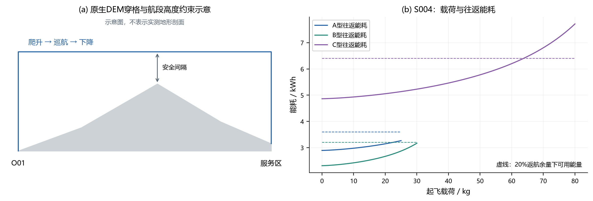
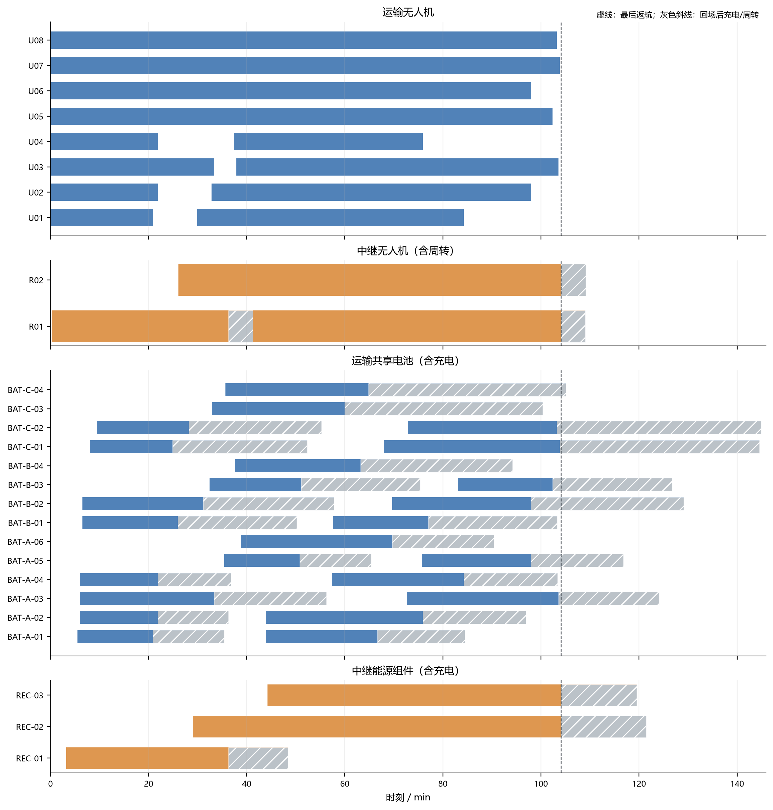
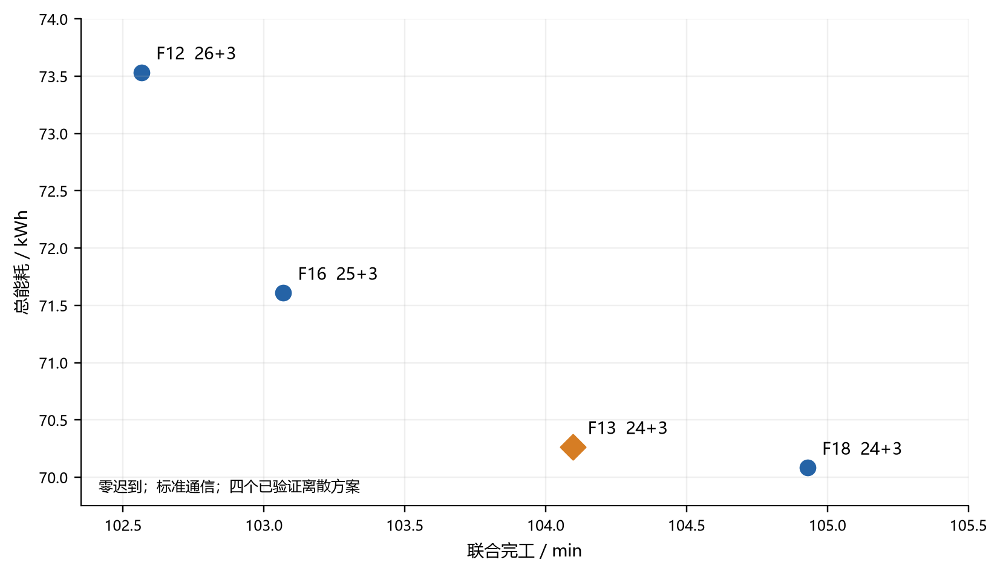
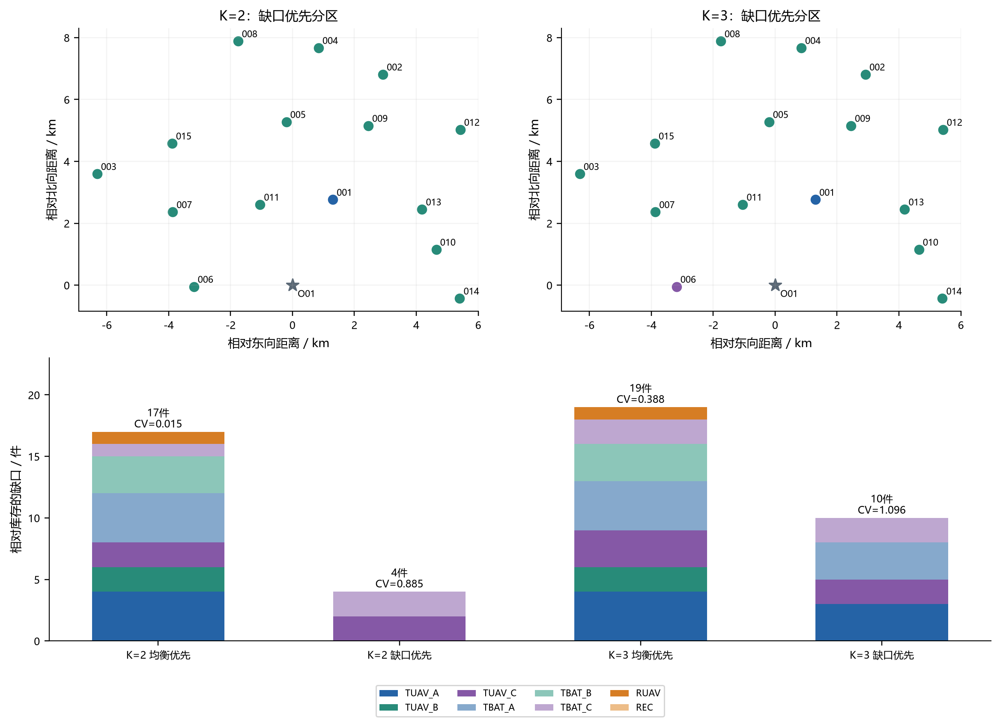

# 山区洪涝灾害下运输效率主导的无人机运输—通信中继协同优化与任务分区

## 摘要

山区洪涝灾害往往同时造成道路受阻和通信条件恶化，使无人机救援同时面对地形净空、动态载荷、有限电量、共享资源和连续通信等约束。若运输与通信分开求解，容易出现运输方案时效较好但中继资源无法排开的情况；若在运输阶段预先施加过强的通信限制，又可能过早舍弃高效运输结构。针对赛题给出的15个服务区、80箱不可拆物资和异构无人机资源，本文建立统一的地形—载荷—能量—资源模型，并构造运输效率主导的运输—中继分解协调方法。首先依据数字高程模型确定航段净空和飞行时间，结合动态载荷、返航余量及分段充电形成可执行运输模式；随后在实体无人机和共享电池约束下完成运输结构选择与资源排程。对于直连不足的飞行区间，将通信缺口转化为中继服务任务，动态生成中继服务模式，并把中继占用冲突反馈到运输时序和资源次序。最后，在零迟到条件下采用时间预算分析时效、能耗和架次数之间的离散权衡，并在固定联合方案上完成两组和三组独立任务分区。

在20%返航剩余电量要求下，单点运输需要18个架次，总能耗为59.131 kWh；当安全余量提高到25%和30%时，最少架次数分别增至19次和20次，关键变化阈值约为23.09%和27.05%。运输—通信联合主方案实现全部物资零迟到，联合完工时间为104.097 min，总能耗为70.264 kWh，使用24次运输和3次中继。与最快的已验证近快端方案相比，仅增加91.9 s，即减少2次运输并节省3.269 kWh；继续放宽约49.9 s仅再节省0.180 kWh且架次数不再下降。固定该联合方案后得到4个不可拆任务块，完整枚举两组和三组分区后，缺口优先方案分别需要补充4件和10件分类型资源，而追求工作量均衡会显著增加独立配置需求。结果说明，在保证安全、时限和通信连续性的前提下，将通信资源冲突反馈到运输排程，可在保留高效运输结构的同时恢复联合可执行性；安全余量、救援时效与独立资源配置之间均呈现明显的离散权衡。

**关键词：** 山区洪涝；应急物流；异构无人机；通信中继；共享电池；分解协调；任务分区

---

## 1 引言

山区洪涝灾害会同时削弱道路通行能力和通信基础设施。当地面道路短时难以恢复时，无人机能够绕开受阻路段，将医疗和生活保障物资快速送达需求点，因此成为灾后“最后一程”运输的重要补充[1,11,12]。与常规配送不同，山区无人机的可执行性不仅由访问距离决定，还受到地形起伏、动态载荷、电池周转和装备库存约束；当固定通信设施覆盖不足时，运输无人机还需要依赖空中中继维持与指挥端的联系[7,13]。因此，本题的核心不是分别求一组运输路线和一套通信方案，而是在有限实体无人机、电池、中继机和能源组件条件下形成一套能够按时送达、持续通信并可真实执行的联合计划[14]。

这类联合任务存在三类相互作用的困难。第一，运输物理条件会随任务过程变化。无人机跨越山脊需要额外爬升，起飞载荷越大，平飞和爬升能耗越高；多点投送过程中载荷逐站下降，使访问顺序进一步影响各航段能耗。第二，资源约束具有显著的时间耦合。一次飞行结束后，无人机、电池、中继机和能源组件并不会同时立即恢复可用，充电和周转会改变后续架次的最早开始时刻。第三，通信“有站点可覆盖”并不等于“有限中继资源可执行”。若多个通信缺口在时间上集中，即使每个缺口单独存在可用站点，有限的中继无人机仍可能因出航、服务、返航和周转重叠而无法排程。

已有研究分别从应急无人机配送、异构机队、充电调度和空中通信等角度给出了重要基础。应急物流研究强调了时效、需求和运力限制对无人机救援决策的影响[1,11,12]；异构车辆路径与模式选择方法为机型和路线联合决策提供了建模基础[2,5]；非线性充电研究说明资源再次可用时刻不宜被简化为固定常数[3]；空中通信与中继研究则表明轨迹、位置和链路资源之间存在天然耦合[7,13]。但本题进一步要求运输全过程通信可用，并且所有实体资源均需落到统一时间轴上。如果只采用“运输优化→通信事后检查”的单向串联方式，容易得到运输效率较高却无法完成通信保障的方案；反之，若在运输结构生成阶段直接使用过度保守的通信限制，又可能提前排除本可通过时序协调恢复可行性的高效结构。

基于这一矛盾，本文采用“先保留高效运输结构，再由通信冲突反馈调整时序”的总体思路。问题一确定单点安全载荷和不可拆货箱组批规律；问题二将货箱组合、访问顺序、机型和共享资源统一到运输排程中；问题三沿实际三维轨迹提取通信缺口，动态构造中继服务模式，并将中继资源冲突转化为运输时序反馈；问题四固定最终联合方案，根据运输和中继依赖关系划分独立任务组并核算分类型资源缺口。全文采用统一的地形、时间、能耗、SOC和通信口径，使四问形成连续的数据链。

本文的主要工作分为三个层次：

1. **统一建模。** 将DEM净空、动态载荷能耗、分段充电和四类实体资源日历纳入统一模型，使“路线可行”进一步落实为“资源可执行”。
2. **运输—中继协调。** 将直连不足区间转化为中继任务，通过动态服务模式和可解释的占用冲突反馈调整运输时序，在不改变货箱组合、访问顺序和机型的前提下恢复联合可执行性。
3. **结果与决策分析。** 在零迟到层内用时间预算分析近快端的时效—资源取舍，并在固定联合方案上完整枚举独立分区，量化资源共享被打破后产生的配置代价。

**图1 运输、通信与独立分区的总体技术路线。**

---

## 2 问题分析、建模假设与评价口径

### 2.1 四问之间的递进关系

赛题包含一个调度中心、15个服务区和80箱不可拆物资，配置A、B、C三类运输无人机及共享电池，同时配置2架中继无人机和6组能源组件[14]。四个问题具有明确的数据继承关系：问题一给出单点运输能力和组批基础；问题二进一步决定多点访问、机型、实体无人机、电池和实际时刻；问题三继承运输结构及其轨迹，再加入连续通信保障；问题四必须固定问题三的运输与中继任务关系后进行独立分区。因此，后续问题不能只继承前一问的一个标量指标，而应继承能够重建完整时空状态的执行方案。

### 2.2 建模假设与边界

在不改变题面规则的前提下，采用以下建模假设：

1. 调度周期内DEM、设备参数和题设通信参数保持不变；题面未给出的动态风雨和设备随机故障暂不引入。
2. 运输航段按题设节点间直线飞行，巡航高度由沿线地形净空确定；无线视距仍按题设通信判定模型单独计算。
3. 货箱不可拆且仅交付一次；交付完成时刻取服务区交接完成时刻。多点运输中，每完成一次交付即更新后续航段载荷。
4. 电池和中继能源组件初始满电，再次投入任务前按题设充电规则恢复至可用状态；不同机型能源不可混用。
5. 直连可用时优先采用直连；直连不足时由单架中继形成“运输机—中继—基地”两跳链路，不引入中继间多跳。
6. 问题四固定最终联合方案的运输架次、中继架次及其关联关系，各组独立配置资源，不允许跨组共享。

这些假设用于建立可计算模型；时间离散、通信采样和中继候选点离散属于数值实现设置，不视为题面物理定律。

### 2.3 目标层级与评价指标

救援任务首先要满足安全、硬时限和通信连续性。本文将载荷、体积、返航电量、硬截止、实体资源冲突和连续通信视为可行性条件；在可行基础上，先实现零迟到，再比较物资送达时效、联合完工时间、总能耗以及运输和中继架次数。

设货箱$b$的交付完成时刻为$t_b$，参考时效为$d_b$，物资权重为$w_b$，定义

\[
J_{\rm late}=\sum_b w_b\max(0,t_b-d_b),\qquad
J_{\rm norm}=\frac{\sum_b w_b t_b/d_b}{\sum_b w_b}.
\]

其中，$J_{\rm late}$用于判断是否存在迟到，$J_{\rm norm}$用于描述零迟到层内的加权交付早晚。联合完工时间$T_{\rm joint}$定义为全部运输无人机和中继无人机完成飞行并返回基地的最晚时刻；返航后的充电和周转仍计入资源再次可用时刻，但不计入本次联合飞行完工指标。运输架次数$N_T$和中继架次数$N_R$分别保留，避免用“总架次”掩盖两类资源的不同作用。

主要符号如下。

|符号|含义|
|---|---|
|$q,Q_k$|当前载荷、机型$k$额定载荷|
|$B_k,\rho$|电池额定能量、返航剩余电量比例|
|$x_p$|运输模式$p$的使用次数|
|$a_j$|运输架次$j$的准备开始时刻|
|$z_m$|中继服务模式$m$是否被选择|
|$J_{\rm late},J_{\rm norm}$|迟到指标、归一化交付时效|
|$T_{\rm joint},E_{\rm total}$|联合完工时间、总能耗|
|$N_T,N_R$|运输架次数、中继架次数|

### 2.4 数值求解设置

运输候选由统一物理判定器生成，当前有限候选池包含2903个运输模式。运输排程采用保守0.1 s时间网格产生候选，再以连续物理时间重算最终执行指标。通信层使用118个离散中继候选位置；完整轨迹核验以0.5 s为基础采样，并在通信区间边界细化到0.1 s。上述离散设置均用于控制计算规模，最终结论只在相应候选域和数值精度下成立。

### 2.5 相关方法与本文位置

运输层采用“模式选择+资源排程”的组合思路。以完整可行路线或服务模式作为候选，再用整数变量选择其组合，是配送优化中的经典方法[5]；异构机队研究说明机型和路线需要联合决定[2]。大邻域搜索可用于产生结构多样的候选[4]，但本文的方法主线不是某个启发式名称，而是运输结构、资源排程和通信反馈之间的接口。

通信层借鉴空中中继的位置—轨迹—链路耦合思想[7,13]，并采用逻辑反馈的分解思想[6]。动态中继模式按当前通信任务逐步生成，不具备完整定价和全局收敛保证，因此只用于构造高质量可执行方案。多目标部分采用$\varepsilon$约束思想[9]，通过限定联合完工时间后减少运输架次和能耗，使不同比例尺的目标保持可解释。

---

## 3 地形、载荷、能源与资源的统一模型

### 3.1 航段地形与飞行时间

将经纬度坐标转换到UTM 49N平面后，以任务节点之间的直线作为水平航段。沿原生DEM栅格检查航段经过的全部像元，取沿线最高地形并加50 m净空确定巡航高度。设水平距离为$d_{ij}$，爬升、下降高度分别为$h^+_{ij}$、$h^-_{ij}$，机型$k$的爬升、巡航和下降速度分别为$v_k^+$、$v_k$、$v_k^-$，则航段飞行时间为

\[
\tau_{ij,k}=\frac{h^+_{ij}}{v_k^+}+\frac{d_{ij}}{v_k}+\frac{h^-_{ij}}{v_k^-}.
\]

准备、装载和交接时间另按题设规则计入任务时间轴。该处理保留山区垂直运动的时间代价，而不是直接用空间距离除以单一巡航速度。

### 3.2 动态载荷能耗

多点配送过程中，卸货后剩余载荷逐步减少，因此每一航段应使用该段实际载荷计算能耗。设机型$k$额定载荷为$Q_k$，空载和满载等效航程分别为$R_{k,0}$和$R_{k,F}$，当前载荷为$q$，题设等效航程写为

\[
R_k(q)=R_{k,0}-(R_{k,0}-R_{k,F})(q/Q_k)^{1.5}.
\]

若电池额定能量为$B_k$，单段平飞能耗和爬升能耗分别为

\[
E^{\rm cr}_{ij,k}=B_k\frac{d_{ij}}{R_k(q)},\qquad
E^{\rm up}_{ij,k}=\frac{(m_k+q)gh^+_{ij}}{\eta_k\,3.6\times10^6}.
\]

每次交付后更新$q$，返航段使用实际剩余载荷。若要求返航后保留比例为$\rho$的电量，则架次总能耗需满足

\[
E_p\le (1-\rho)B_k.
\]

此外还需同时满足质量和体积限制。因此，“货物装得下”和“能够安全返航”是两个独立的可行性条件。

### 3.3 充电与实体资源日历

完成一次飞行后，无人机与电池的可用时刻并不相同。设返航后SOC为$u$，完全充电时间参数为$T_k^{\rm ch}$，按照题设分段充电规则，有

\[
t_k^{\rm ch}(u)=T_k^{\rm ch}
\begin{cases}
0.65(0.9-u)/0.9+0.35, & u<0.9,\\
0.35(1-u)/0.1, & u\ge0.9.
\end{cases}
\]

运输无人机从准备开始占用到返航结束，运输电池从起飞占用到充电完成；中继无人机从准备开始占用到返航后的周转结束，中继能源组件从起飞占用到充电完成。对四类资源分别建立时间区间，可直接检查同一实体是否发生冲突。分段充电对资源再次投入时间的影响与相关电动车路径研究中的结论一致[3]，但本文所有具体充电参数均来自赛题附件。

### 3.4 双向链路与中继条件

自由空间传播损耗采用ITU-R P.525给出的对数关系[8]。当频率以MHz、距离以km计时，

\[
L_{\rm FS}=32.45+20\log_{10}f+20\log_{10}d.
\]

在此基础上按照题设加入天线增益、系统损耗和地形遮挡附加损耗，并以双向链路中较弱方向作为判据。运输无人机与基地直连满足门限时优先直连；直连不足时，必须同时满足“运输无人机—中继无人机”和“中继无人机—基地”两段链路。本文通信判定使用确定性链路预算，主方案不额外叠加题设之外的鲁棒余量。

**图2 地形净空、动态载荷、能耗与返航余量的统一关系。**

---

## 4 问题一：单点运输能力与安全余量敏感性

### 4.1 最大安全载荷与货箱组批

对于服务区$s$和机型$k$，先求满足额定载荷、体积和往返能量约束的最大安全载荷，再考虑货箱不可拆分带来的离散组批。对服务区内全部货箱子集进行可行性筛选，并以已覆盖货箱集合为状态进行动态规划。组批选择依次优先减少架次数、降低总能耗，再比较相应方案的累计作业时长。若$B$表示某服务区尚未分配的货箱集合，$U\subseteq B$为一次可行装载，$g$为机型，则采用字典序动态规划

\[
F(B)=\operatorname{lexmin}_{U,g}\left\{(1,E(U,g),T(U,g))+F(B\setminus U)\right\},\qquad F(\varnothing)=(0,0,0).
\]

该递推在单服务区全部货箱子集和三类机型上求解，因此问题一的“最少架次—同架次最低能耗”可以在这一有限组合域内精确核对。

在基准20%返航剩余电量要求下，80箱物资可由18个单点架次完成，总能耗为59.130796 kWh，累计架次作业时长为32776.093 s。这里的累计作业时长是各单点架次时长之和，用于描述单点运输工作量，不等同于多机并行条件下的系统完工时间。

### 4.2 安全余量提高导致的离散跃迁

固定地形、需求和设备参数，仅改变返航剩余电量要求，重新计算45个机型—服务区载荷上限和全部货箱组合，结果见表1。

|返航余量|最少架次|总能耗/kWh|累计作业时长/s|A/B/C架次|
|---:|---:|---:|---:|---:|
|10%|18|59.130796|32776.093|0/9/9|
|15%|18|59.130796|32776.093|0/9/9|
|20%|18|59.130796|32776.093|0/9/9|
|25%|19|61.072859|34565.741|0/10/9|
|30%|20|67.227086|36586.269|0/9/11|

**表1 不同返航安全余量下的单点组批结果。**

10%—20%区间内，安全余量虽然持续提高，但原有18个离散箱组仍然可行，因此架次数和总能耗保持不变。当余量超过约23.09%时，S004的一组整批货箱失去单架次可行性，25%档需要增加一次运输；当余量超过约27.05%时，S008发生相同变化，30%档进一步增加到20架次。与此同时，S002和S003虽未增加架次数，但最优机型组合发生变化。由此可见，安全余量对运输能力的作用是连续的，而不可拆货箱使最终架次数呈阶跃变化。

**图3 返航安全余量变化与单点架次数、能耗及关键阈值。**

---

## 5 问题二：运输模式生成与异构资源排程

### 5.1 以运输模式封装物理可行性

一个运输模式由货箱组合、服务区访问顺序和机型组成。给定模式后，各航段载荷、飞行时间、能耗、交付偏移和充电时长均可由第3节模型预计算。根据目的地、质量、体积、时限和权重等属性将货箱压缩为61个等价需求类别，生成2903个候选运输模式，其中296个为单点模式，2607个为两点模式。该候选集用于控制组合规模，但不等同于全部可能路线的穷举。

设模式$p$包含第$c$类货箱$a_{cp}$个，第$c$类需求量为$n_c$，模式使用次数为$x_p$，则覆盖约束为

\[
\sum_{p\in\mathcal P}a_{cp}x_p=n_c,\qquad x_p\in\mathbb Z_{\ge0}.
\]

模式选定后再恢复到具体货箱编号，并检查80箱全部且仅交付一次。

### 5.2 从模式选择到实体资源排程

运输结构确定后，还需将每个架次分配给具体无人机和电池，并决定准备、起飞、交付、返航和充电时刻。调度层同时检查硬截止、机型库存、无人机时间冲突和电池充电冲突。设架次$j$在时刻$a_j$开始，其运输无人机占用区间为$I_j^U(a_j)$，电池占用区间为$I_j^B(a_j)$。对任一机型$k$和时刻$t$，容量约束写为

\[
\sum_{j\in\mathcal J_k}\mathbf 1\{t\in I_j^U(a_j)\}\le n_k^U,\qquad
\sum_{j\in\mathcal J_k}\mathbf 1\{t\in I_j^B(a_j)\}\le n_k^B.
\]

所有硬截止通过“架次开始时刻+模式内交付偏移”直接约束。候选搜索采用保守时间离散，最终方案按连续物理时间重新计算，因此离散模型中的求解器边界只用于该离散域内部，不能直接当作连续时间原问题的最优性证明。

**图4 候选运输模式、服务区访问关系与实体资源排程。**

### 5.3 固定主方案结构的排程紧度

对于最终主方案所采用的箱组、访问顺序和机型，可利用各类无人机不可重叠工作量构造固定结构的完工下界6211.269 s。主方案实际运输完工为6229.812 s，距离该下界约18.54 s；加入中继任务后联合完工为6245.793 s。该结果说明，主方案的运输时序已经接近其固定结构下的资源工作量极限，但该下界不覆盖其他运输结构，因此不作为全局最优性结论。

---

## 6 问题三：运输效率主导的运输—中继分解协调

### 6.1 从运输轨迹提取通信缺口

根据当前运输结构和时刻生成三维飞行轨迹，并在准备、爬升、巡航、下降、交接和返航阶段检查与基地的直连链路。将直连不满足门限的时间段合并为通信需求区间，同时记录运输架次、相对时间、空间位置和可服务站点。候选中继站点固定为根据题面场景生成的118个位置，每个新运输结构均重新计算任务—站点可服务关系。

这种处理把“全过程通信”从连续轨迹约束转化为一组具有明确时空边界的服务任务。需要强调的是，某个任务存在可用站点只能说明链路层可覆盖，仍需进一步检查中继无人机能否按时到达以及有限资源是否能够连续执行这些服务。

### 6.2 动态构造中继服务模式

一个中继服务模式表示某架中继无人机一次出返航中，在某一站点保障若干通信任务。对于时间相邻且具有共同可用站点的任务，尝试合并为同一中继架次。设主动通信总时长为$D_a$，任务之间仍需在站悬停的空闲时长为$D_i$，悬停功率和通信附加功率分别为$P_h$和$P_c$，则服务阶段能耗为

\[
E^{\rm service}=\frac{(P_h+P_c)D_a+P_hD_i}{3600}.
\]

再叠加出航、建链和返航能耗，并检查返航余量、两跳链路以及中继机和能源组件的占用日历。设原子通信任务集合为$\mathcal A$，候选中继模式集合为$\mathcal M$，$c_{am}=1$表示模式$m$能够完整保障任务$a$，二元变量$z_m$表示是否选择模式$m$。固定运输时刻后，基本覆盖与资源容量约束可写为

\[
\sum_{m\in\mathcal M}c_{am}z_m=1,\quad \forall a\in\mathcal A,
\]

\[
\sum_m \mathbf 1\{t\in I_m^R\}z_m\le 2,\qquad
\sum_m \mathbf 1\{t\in I_m^C\}z_m\le 6.
\]

其中$I_m^R$和$I_m^C$分别表示中继无人机和能源组件占用区间。由于通信任务组合数量较大，本文不预先穷举全部模式，而是根据当前任务和冲突逐步生成有用的中继模式。该过程属于启发式动态模式生成，其目标是提高可执行方案的构造效率。

### 6.3 中继资源冲突反馈到运输排程

通信困难并不一定来自链路本身。对于某些快速运输时刻，多项通信需求分别需要不同站点，而出航、建链、服务、返航和周转时段相互重叠，使2架中继无人机无法同时承担所有任务。此时，如果仅依据“每个任务都有可用站点”进行判断，会得到链路可行但资源不可执行的假象。

因此，本文保留已经形成的货箱组合、访问顺序和机型，仅允许运输开始时刻、同型无人机次序和电池次序调整。根据中继占用区间生成必要的时序反馈条件，使部分冲突任务错开。若任务$a,b$不能由同一中继架次共同承担，则反馈至少满足一个先后关系

\[
\operatorname{end}(I_a)\le \operatorname{start}(I_b)\quad \text{或}\quad
\operatorname{end}(I_b)\le \operatorname{start}(I_a).
\]

该约束只由已经核实的资源占用冲突产生，不把求解器超时解释为不可行。调整运输时刻后，再重新计算通信需求和中继模式。该过程构成闭环：

\[
\text{运输排程}\rightarrow\text{通信缺口}\rightarrow\text{中继模式}
\rightarrow\text{资源冲突}\rightarrow\text{运输时序反馈}.
\]

反馈调整的是任务发生时间和资源次序，而不是删除原有通信需求。这样既保留运输层已经获得的高效结构，又能利用通信层提供的具体冲突信息恢复联合可执行性。

**图5 通信缺口、中继服务模式和运输时序反馈的协调机制。**

### 6.4 分解协调求解流程

运输—中继联合求解采用“运输主问题—通信子问题—必要反馈”的循环。为避免把启发式搜索结果误写成精确分解算法，本文只使用能够由原物理模型重新核验的反馈信息。具体步骤如下：

1. 由统一物理判定器生成运输候选模式，并在给定时间预算下求解运输结构与实体资源排程；
2. 按当前运输时刻重建三维轨迹，提取直连不足区间及其可服务站点；
3. 固定运输时刻，生成并选择中继服务模式，检查2架中继无人机和6组能源组件的完整时间占用；
4. 若中继方案闭合，则进入独立全航程验证；若出现能够复核的占用冲突，则形成必要时序反馈，返回运输排程；
5. 重新计算运输时刻对应的通信任务和中继模式，直至得到零迟到、通信完整的执行见证，或在当前计算预算内不再获得新的有效改进。

其中，求解器超时只表示当前运行未获得新的见证，不被转换为“物理不可行”结论；动态模式生成也不承担完整定价证明。最终进入结果表的方案均需通过连续物理重算和独立通信核验。

### 6.5 联合执行结果与通信核验

最终主方案使用24次运输和3次中继，全部80箱物资零迟到，运输能耗为67.312325 kWh，中继能耗为2.952007 kWh，总能耗为70.264332 kWh。运输任务最晚返航时间为6229.812 s，中继加入后的联合完工时间为6245.793 s，即104.097 min。

全部运输无人机、电池、中继无人机和能源组件均建立独立资源日历并检查无重叠冲突。通信核验沿实际完整飞行轨迹进行，共检查69003个时空采样点，以0.5 s为基础步长，并在通信区间边界进一步细化到0.1 s；在该数值精度下未发现未保障样本。该结果用于确认执行方案的一致性，通信结论的适用范围限于所采用的确定性链路模型和数值检查精度。

**图6 主方案的运输无人机、电池、中继无人机和能源组件占用情况。**

---

## 7 零迟到条件下的时效—资源折中与主方案选择

### 7.1 近快端方案比较

在保证零迟到和完整通信的前提下，逐步放宽联合完工时间预算，并优先寻找更少的运输架次和更低的总能耗。相比直接把时间、能耗和架次数加权为单一分数，ε约束方法[9]能够直接回答“多给多少时间，可以节省多少资源”。表2列出近快端的四个已验证方案，并增加一个低资源代表用于说明远端取舍。

|方案角色|$J_{\rm norm}$|联合完工/min|总能耗/kWh|运输架次|中继架次|
|---|---:|---:|---:|---:|---:|
|极速端|0.474795|102.5649|73.533764|26|3|
|中间方案|0.480683|103.0680|71.610015|25|3|
|**主方案**|**0.473265**|**104.0966**|**70.264332**|**24**|**3**|
|节能邻近方案|0.470741|104.9285|70.083932|24|3|
|低资源方案|0.632131|189.8033|66.500477|19|4|

**表2 零迟到条件下的已验证代表方案。**

**图7 近快端方案的联合完工时间、总能耗与架次数。**

### 7.2 主方案的选择依据

从极速端移动到主方案，联合完工增加91.9 s，但运输架次由26次降低到24次，总能耗下降3.269 kWh，约4.45%；同时$J_{\rm norm}$由0.474795下降到0.473265，说明平均加权交付过程并未因最后返航稍晚而恶化。继续从主方案移动到节能邻近方案，联合完工再增加49.9 s，而能耗仅进一步下降0.180 kWh，运输和中继架次数均不再减少。

因此，在当前已验证近快端方案中，主方案位于一个明显的收益转折位置：它保留了接近最快方案的救援完成速度，同时已经获得24次运输和约70.26 kWh的较低资源代价。本文据此将其作为后续问题四的固定执行方案。该选择反映的是“运输效率优先、兼顾资源”的决策偏好，而不是宣称存在唯一的多目标全局最优点。

---

## 8 问题四：固定联合方案下的独立任务分区

### 8.1 由运输和中继依赖形成不可拆块

问题四要求不同任务组独立执行，因此不能在分组后继续跨组共享无人机、电池或中继资源。与此同时，问题三已经确定的多点运输关系和中继保障关系不能被任意拆开。将15个服务区作为节点，将同一运输架次涉及的服务区以及同一中继架次关联的运输任务表示为超边，得到4个不可拆任务块：

|块|服务区|
|---|---|
|1|S001|
|2|S002、S004、S008、S010、S012、S013、S014|
|3|S003、S005、S007、S009、S011、S015|
|4|S006|

**表3 主方案固定任务关系下的4个不可拆任务块。**

将4个块划分为非空两组或三组。若$y_{hg}=1$表示不可拆块$h$分配给任务组$g$，则满足

\[
\sum_g y_{hg}=1,\quad \forall h,\qquad
\sum_h y_{hg}\ge 1,\quad \forall g.
\]

由于块数仅为4，消除组标签置换后，两组和三组分别只有7种和6种合法分区，因此无需再使用启发式搜索，可完整枚举固定任务域中的全部分组方案。

### 8.2 独立资源需求与工作量均衡

对于分区后的第$k$组和第$r$类资源，保持所有任务时间区间不变，资源需求取同时占用的最大数量：

\[
n_{kr}=\max_t\sum_{i\in\mathcal I_{kr}}\mathbf1\{t\in I_i\}.
\]

固定区间上的最大重叠数既是该类资源的必要数量，也可通过区间分配实现[10]。各组独立执行后，对同一类型资源分别求和，并与现有库存$N_r$比较：

\[
D_r=\max\left(0,\sum_k n_{kr}-N_r\right).
\]

工作量定义为组内运输无人机从准备到返航的占用时长，加上中继无人机从准备到周转结束的占用时长；以各组工作量的变异系数$CV$评价均衡程度。

### 8.3 两组与三组的资源代价

完整枚举结果见表4。

|分组数|选择原则|资源总缺口/件|工作量CV|
|---:|---|---:|---:|
|2|缺口优先|4|0.884649|
|2|均衡优先|17|0.015342|
|3|缺口优先|10|1.095586|
|3|均衡优先|19|0.388394|

**表4 固定主方案下两组和三组的独立分区结果。**

对于缺口优先方案，两组执行需要增加C型运输机2架、C型电池2组；三组执行除上述资源外，还需要增加A型运输机3架和A型电池3组。中继无人机和中继能源组件在两类缺口优先分区中均不需要额外增加。表5给出分类型需求。

|资源类型|现有库存|两组需求|两组缺口|三组需求|三组缺口|
|---|---:|---:|---:|---:|---:|
|A型运输机|4|4|0|7|3|
|B型运输机|2|2|0|2|0|
|C型运输机|2|4|2|4|2|
|A型电池|6|6|0|9|3|
|B型电池|4|4|0|4|0|
|C型电池|4|6|2|6|2|
|中继无人机|2|2|0|2|0|
|中继能源组件|6|3|0|3|0|

**表5 缺口优先分区的分类型资源需求。**

两组缺口优先方案倾向于将大任务块集中在一组，从而减少资源峰值的重复配置，但工作量差异较大；均衡优先方案能够显著降低$CV$，代价是更多类型的资源需要在各组独立配置。三组分区进一步削弱了原有共享资源的时间复用能力，因此资源缺口继续增加。问题四由此揭示了一个与前三问一致的规律：越强调任务组织上的独立性和均衡性，越需要为失去的资源共享能力付出额外配置代价。

**图8 固定主方案下的两组、三组分区及资源缺口比较。**

---

## 9 模型验证与适用范围

本文把结果验证分成三个层次：首先验证单个航段和架次的物理可行性，其次验证完整时间轴上的实体资源与通信可执行性，最后再区分哪些结论具有严格有限域最优性、哪些只是已验证方案中的最好已知结果。

问题一方面，五档安全余量共重新计算225个机型—服务区载荷上限，并对15个服务区×5档方案分别采用独立整数覆盖模型核对最少架次和固定架次后的最低能耗。问题二、三方面，主方案检查80箱唯一交付、动态载荷能耗、硬时限、运输无人机与电池日历、中继无人机与能源组件日历以及数值全航程通信。问题四方面，4个不可拆任务块、7种两组分区和6种三组分区均完整枚举，并通过事件扫描和区间分配复核各类资源峰值。

现有证据能够支持主方案在给定模型和候选域内的可执行性，但不同结论的适用范围需要区分。运输候选集包含2903个预生成模式，中继站点为118个离散候选，因此未穷尽所有连续空间决策；动态中继模式采用启发式生成，不具备完整定价证明。近快端比较基于已经独立核验的有限方案集合，不代表完整Pareto前沿。固定主方案结构下的工作量下界只用于衡量该结构的排程紧度，不能推广为原问题全局下界。通信保障采用确定性链路预算和数值采样验证，未进一步考虑随机衰落、设备故障和天气变化。

这些限制不会改变本文对当前赛题实例的主要结论，但明确了模型向真实灾后系统推广时需要增加的内容：随机天气和链路不确定性、滚动重调度、连续中继位置优化以及更完整的路径列生成等。

---

## 10 结论

本文围绕山区洪涝灾害中的应急物资运输与通信保障，建立了从单点运输能力、异构资源调度到空中中继和独立任务分区的一体化模型。与将运输和通信分别求解的思路不同，本文先保留具有较高运输效率的结构，再根据实际三维轨迹识别通信缺口，并把中继资源冲突反馈到运输时序和资源次序，从而形成可执行的运输—中继联合方案。

在20%返航剩余电量要求下，问题一需要18个单点架次；余量提高到25%和30%时，架次数分别增加到19次和20次，关键变化来自不可拆货箱整批可行性的丧失。联合主方案以24次运输和3次中继完成全部80箱物资配送，实现零迟到、104.097 min联合完工和70.264 kWh总能耗。与更快的近邻方案相比，该方案用约1.5 min的时间增量换取2次运输和3.269 kWh能耗的下降；继续放宽时间后的资源收益明显减小，因此适合作为运输效率优先条件下的折中代表。

固定该联合方案后，15个服务区由运输与中继依赖关系形成4个不可拆任务块。两组和三组独立执行的最小资源缺口分别为4件和10件；若进一步追求工作量均衡，则需要更多独立资源。由此可以看出，山区应急无人机系统中的运输时效、通信保障和独立资源配置并非三个可以相互独立的决策层：前一层形成的时空安排会直接改变后一层的可行域。保留真实任务依赖和资源时间占用，是获得可执行方案的关键。

---

## 参考文献

[1] Rabta B, Wankmüller C, Reiner G. A drone fleet model for last-mile distribution in disaster relief operations[J]. *International Journal of Disaster Risk Reduction*, 2018, 28: 107-112. DOI: 10.1016/j.ijdrr.2018.02.020.

[2] Golden B, Assad A, Levy L, Gheysens F. The fleet size and mix vehicle routing problem[J]. *Computers & Operations Research*, 1984, 11(1): 49-66. DOI: 10.1016/0305-0548(84)90007-8.

[3] Montoya A, Guéret C, Mendoza J E, Villegas J G. The electric vehicle routing problem with nonlinear charging function[J]. *Transportation Research Part B: Methodological*, 2017, 103: 87-110. DOI: 10.1016/j.trb.2017.02.004.

[4] Ropke S, Pisinger D. An Adaptive Large Neighborhood Search Heuristic for the Pickup and Delivery Problem with Time Windows[J]. *Transportation Science*, 2006, 40(4): 455-472. DOI: 10.1287/trsc.1050.0135.

[5] Balinski M L, Quandt R E. On an Integer Program for a Delivery Problem[J]. *Operations Research*, 1964, 12(2): 300-304. DOI: 10.1287/opre.12.2.300.

[6] Hooker J. *Logic-Based Benders Decomposition: Theory and Applications*[M]. Springer, 2024. DOI: 10.1007/978-3-031-45039-6.

[7] Zeng Y, Zhang R, Lim T J. Wireless Communications with Unmanned Aerial Vehicles: Opportunities and Challenges[J]. *IEEE Communications Magazine*, 2016, 54(5): 36-42. DOI: 10.1109/MCOM.2016.7470933.

[8] ITU-R. *Calculation of free-space attenuation*[S]. Recommendation ITU-R P.525-5, 2024.

[9] Mavrotas G. Effective implementation of the ε-constraint method in Multi-Objective Mathematical Programming problems[J]. *Applied Mathematics and Computation*, 2009, 213(2): 455-465. DOI: 10.1016/j.amc.2009.03.037.

[10] Kleinberg J, Tardos É. *Algorithm Design*[M]. Pearson/Addison-Wesley, 2006.

[11] Gentili M, Mirchandani P B, Agnetis A, Ghelichi Z. Locating platforms and scheduling a fleet of drones for emergency delivery of perishable items[J]. *Computers & Industrial Engineering*, 2022, 168: 108057. DOI: 10.1016/j.cie.2022.108057.

[12] Dukkanci O, Koberstein A, Kara B Y. Drones for relief logistics under uncertainty after an earthquake[J]. *European Journal of Operational Research*, 2023, 310(1): 117-132. DOI: 10.1016/j.ejor.2023.02.038.

[13] Tran D H, Nguyen V D, Chatzinotas S, et al. UAV Relay-Assisted Emergency Communications in IoT Networks: Resource Allocation and Trajectory Optimization[J]. *IEEE Transactions on Wireless Communications*, 2022, 21(3): 1621-1637. DOI: 10.1109/TWC.2021.3105821.

[14] 《山区洪涝灾害下无人机运输与通信协同优化》及配套数据与结果提交模板[Z]. 赛题提供资料.

---

## 附录A 结果文件映射说明（提交前可移至支撑材料）

为保持正文可读性，正文采用“极速端—中间方案—主方案—节能邻近方案—低资源方案”的语义名称。其内部复现标识分别对应F12、F16、F13、F18和C01。正式提交表、逐箱交付表、运输与中继资源日历均使用主方案的同一套实际执行时刻，不与其他比较方案拼接。
