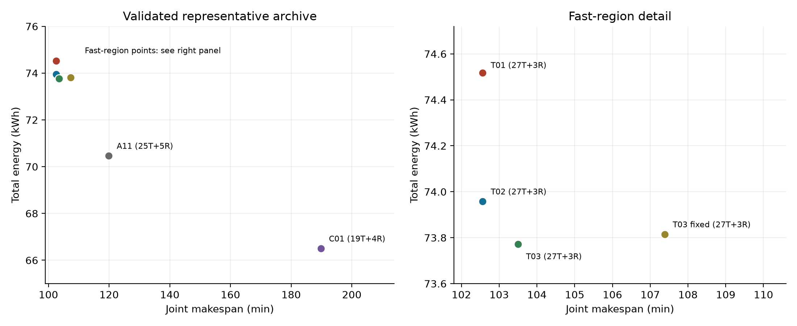
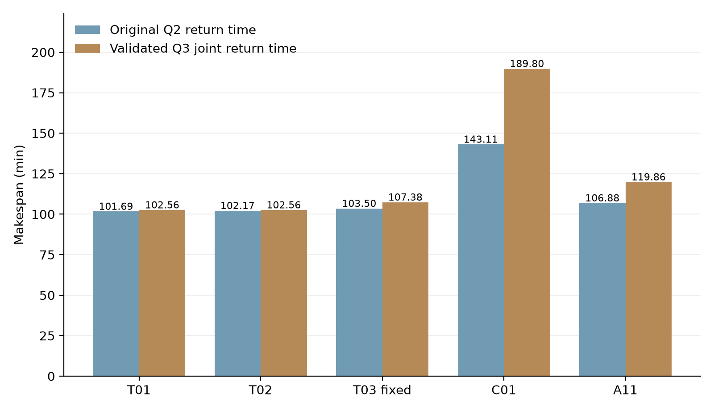

# 山区应急配送中运输效率主导的运输—中继分解协调与独立任务分区

> 中文正文 V0.1，数据冻结于提交 `842d950eba19374a287351b9b839fb446ff55d14`。本文是已有验证证据支持的完整工作稿，不是最终提交版。正文快速代表已更新为 T01/T02，问题四仍为 A11 历史算例，不能将两者拼成同一套最终答案。本版不吸收正在进行的快端折中搜索结果。

## 摘要

针对山区洪涝灾害中物资配送、地形净空与通信保障相互耦合的问题，建立统一物理与资源模型，并设计运输效率主导的运输—中继分解协调方法。首先，根据投影平面航段与原生数字高程栅格确定飞行高度，结合逐段载荷、非线性等效航程、返航余量和共享电池充电计算运输模式。其次，在有限自主模式池内联合选择货箱组合、机型及资源时序，生成高效运输结构。随后沿三维轨迹提取直连通信不足区间，动态生成中继服务模式，以占用冲突证据和站点—中继机一致性约束反向调整运输时序，最后由独立程序核验完整执行方案。

在题给 80 个不可拆货箱、15 个服务区实例中，问题一获得 18 架次单点组批方案，能耗为 59.131 kWh。问题二在现有 2903 个自主模式内得到 6101.161 s 的零迟到方案，该连续时间有限池的有效完工下界为 5539.261 s，相对间隙为 9.21%。问题三的两套快速代表 T01/T02 均以 27 次运输和 3 次中继实现零迟到，联合完工约 102.565 min，能耗分别为 74.517、73.958 kWh；另一个运输结构保持原时刻不变也能闭合通信，联合完工为 107.384 min。对上述三个固定运输结构，在 118 个冻结站点、既定任务—站点关系和原子任务不拆分的域内，中继架次数下界与已验证上界均为 3。低资源代表以 19 次运输、4 次中继及 66.500 kWh 完成任务，但联合完工增至 189.803 min。对历史 A11 方案的任务依赖进行完整分区枚举，两组、三组的最小分类型库存缺口分别为 2、4 件。结果说明，快速运输结构不必因通信困难而被提前舍弃；通信冲突反馈可以在保持运输结构的条件下恢复可执行性，但更短完工需要与交付时效、能耗及两类架次分别权衡。

**关键词：** 应急无人机；异构资源调度；共享电池；通信冲突反馈；动态模式生成；独立任务分区

## 1 问题重述与研究思路

题目设置一个调度中心、15 个服务区和 80 个不可拆货箱，配置 A、B、C 三类共 8 架运输无人机、14 组分类型共享电池，以及 2 架中继无人机和 6 个能源组件。问题一仅研究单服务区直接往返的载荷能力与货箱组批；问题二允许多服务区访问并加入实体机、电池、充电及交付时限；问题三进一步要求飞行和交接全过程通信可用；问题四固定问题三的任务和保障关系，将服务区划分为两个或三个独立执行组。[1]

四问具有明确的数据继承关系。问题一用于解释载荷与组批规律，其架次作业时长之和不是并行系统完工时间。问题二生成的运输方案决定空间轨迹、阶段时长及交付偏移。问题三据此提取通信需求，必要时重排运输时刻；因而问题二的运输时间表不能直接与问题三的中继表配对。问题四则必须继承一套具体、完整的问题三执行包，禁止把不同候选的运输、通信和资源指标拼接。

本文采用“运输模式—运输排程—通信需求—中继模式—冲突反馈”的分解路线。运输结构包括箱组、服务区访问顺序和机型；运输调度包括开始时刻、实体机、电池及使用次序。分解时优先生成运输效率高的结构，不用未经资源核验的保守通信限制提前排除它们；发生通信资源冲突后，利用有证据的必要约束和联合分配信息修正调度。所得方案必须重新通过原物理与通信检查。

这一方法的贡献在于统一可执行性口径、明确运输与中继间的反馈机制，并把执行见证与适用域清晰的数学证书同时保留。本文不以算法名称代替有效性证据，也不宣称现有方案已达到全局最优或完整 Pareto 前沿。

## 2 假设、符号与评价口径

### 2.1 数据规则、建模选择与数值设定

题给规则包括：货箱不可拆且仅交付一次；不同机型电池不能混用；每次再投入任务前电池或能源组件须充满；不同资源可以并行充电；医疗货箱和首批保障货箱满足对应硬截止；运输按相邻任务节点间水平直线飞行；中继只允许“运输机—中继—网关”两段链路，不允许中继之间多跳。[1]

本文采用以下建模选择：调度周期内地形和设备参数固定；不额外引入题目未给出的风场、随机故障或带宽排队模型；以重力势能除爬升效率计算爬升附加能耗；以交接完成定义货箱交付；对同一中继架次保障的多个对象，通信附加功率按设备开启时段并集计一次。最后一项不等于实际系统拥有无限吞吐能力，而是本题参数化链路与功耗模型的口径。[2]

计算设定与物理规则分别记录。快速结构搜索采用保守 0.1 s 网格；中继候选冻结为 118 处；通信构造和验证采用采样与边界细化；标准场景额外通信安全余量为 \(\Gamma_C=0\)。这些设定界定搜索或验证范围，不是题目对所有可行方案的全局限制。

### 2.2 主要符号

|符号|含义|单位|
|---|---|---|
|\(b,i,g,p\)|货箱、服务节点、机型、运输模式索引|—|
|\(q_b,V_b,w_b,D_b\)|箱质量、体积、优先权重、期望送达期限|kg、m³、—、s|
|\(Q_g,V_g,E_g^{use}\)|机型载质量、容积、电池可用能量|kg、m³、kWh|
|\(a_p,t_b,r_p\)|架次准备开始、交接完成、返场时刻|s|
|\(S,A,K\)|候选中继站、原子通信任务、中继模式集合|—|
|\(I^U,I^B,I^R,I^C\)|运输机、电池、中继机、组件占用区间|s|
|\(J_{late},J_{norm}\)|加权迟到、加权归一化交付时间|权重·s、—|
|\(T_T,T_J,E_T,E_J,N_T,N_R\)|运输/联合完工、运输/联合能耗、两类架次|s、kWh、次|

### 2.3 目标与比较规则

令 \(t_b\) 为箱 \(b\) 的交接完成时刻，定义

\[
J_{late}=\sum_b w_b\max(0,t_b-D_b),\qquad
J_{norm}=\frac{\sum_b w_b t_b/D_b}{\sum_b w_b}.
\]

医疗货箱期望期限和首批截止属于硬约束；两者适用时取较早者。普通货箱期望期限用于评价。\(J_{norm}\) 表示相对于各箱期限的加权交付早晚，不是平均飞行时间。时效先比较 \(J_{late}\)，主指标相同时再比较 \(J_{norm}\)。本文主要结果均处于零迟到层。

问题二保留 \((J_{norm},T_T,E_T,N_T)\)，问题三保留 \((J_{norm},T_J,E_J,N_T,N_R)\)。其中 \(T_J\) 是运输机和中继机全部返场的最晚时刻，不含最后一次返场后的充电完成时间；资源日历仍须延伸至资源释放。运输架次与中继架次分别比较，不能用总架次替代原有非支配关系。

多个目标不合并为任意固定加权和。单目标极值用于定位效率和资源两端；局部折中可采用 \(T_J\le\varepsilon\)、\(J_{late}=0\) 等预算约束，再依次减少运输架次和总能耗。本文冻结数据尚不包含该局部预算扫描的结果，不能预先声称它改善了前沿。

## 3 统一地形、能耗与资源模型

### 3.1 航段几何和阶段时间

把经纬度投影到 UTM 49N，两个任务节点间的平面线段为

\[
\boldsymbol r_{ij}(\lambda)=(1-\lambda)\boldsymbol r_i+\lambda\boldsymbol r_j,\quad 0\le\lambda\le1.
\]

按原生 DEM 注册关系计算线段相触像元，不重采样地形。跨栅格边界检查两侧，过角点检查相触邻域；运输计划巡航海拔为航段最大地面高程加 50 m。调度中心作业高度为地面高程，服务区作业高度为地面以上 30 m；多点投送后重新爬升。中继往返段采用同一净空规则并兼顾端点高度。缺测、出界或非有限地形不作为可行飞行区域。[2,3]

若水平距离、爬升和下降高度分别为 \(d_{ij},h^+_{ij},h^-_{ij}\)，则

\[
t_{gij}=h^+_{ij}/v_g^\uparrow+d_{ij}/v_g^c+h^-_{ij}/v_g^\downarrow.
\]

准备装载时间与交接时间依附件固定项、箱数项累计，准备开始、起飞、抵达和交付四种事件分别存储。原生地形计算已由第二套行带裁剪与数值求根实现复核 240 条有向运输航段；该几何检查不等于无线视距模型的解析精确性证明。[3]

### 3.2 动态载荷能耗与充电

题给机型载荷等效航程为

\[
L_g(q)=L_g^0-(L_g^0-L_g^F)(q/Q_g)^{3/2}.
\]

根据可用能量与等效航程的关系，水平飞行能耗取 \(E_g^{use}d_{ij}/L_g(q)\)。爬升采用本文冻结的势能模型，因此

\[
E_{gij}(q)=E_g^{use}\frac{d_{ij}}{L_g(q)}+
\frac{(m_g^0+q)g_0h^+_{ij}}{\eta_g^\uparrow\,3.6\times10^6}.
\]

每次交付后更新剩余载荷，返场为空载；不能用起飞载荷代替所有航段载荷。附件下降附加能耗取零。架次能量必须满足 \(E_p\le(1-\rho_g)E_g^{use}\)，同时检查质量和容积；标准计算取题给返航余量 20%。

返场 SOC 为 \(s=1-E_p/E_g^{use}\)，充满时间为

\[
t_{chg}(s)=T_{full}\begin{cases}
0.65(0.90-s)/0.90+0.35,&s<0.90,\\
0.35(1-s)/0.10,&0.90\le s\le1.
\end{cases}
\]

运输机从准备开始占用至返场，电池从起飞占用至返场充满。同一类型电池可以跨实体机轮换，但不同类型不能替代。中继机的占用还含返场后周转，能源组件占用包含充电。四类资源必须各自满足不重叠或容量限制。

### 3.3 由容量约束恢复实体编号

对同类资源 \(r\)，令容量为 \(n_r\)，所选任务区间为半开区间 \([l_k,u_k)\)。要求

\[
\sum_k\mathbf1\{l_k\le t<u_k\}\le n_r,\quad\forall t.
\]

区间重叠峰值只需在开始事件检查。按开始时刻排序、优先使用最早释放资源的着色构造可以恢复具体机号或电池号。此结论适用于本题同类资源参数一致、无额外序列相关限制的区间模型；充电、准备与周转已先包含在各自区间内。

## 4 问题一：单点运输能力与不可拆货箱组批

### 4.1 最大安全载荷

对服务区 \(i\) 和机型 \(g\)，载荷能力为

\[
q_{gi}^{max}(\rho)=\max\{0\le q\le Q_g:E_{g,O i}(q)+E_{g,i O}(0)\le(1-\rho)E_g^{use}\}.
\]

在正爬升效率和有效航程范围内，往程能耗随载荷不减，因此可用质量上限判断或一维二分计算边界。这个质量能力不包含某一批货箱的具体体积；实际组批仍须另检查容积。45 个机型—服务区边界全部由独立程序复算，结果见附录 A。

### 4.2 组批动态规划

对每个服务区的货箱集合 \(B_i\)，枚举非空子集 \(U\subseteq B_i\) 及三种机型，保留满足质量、容积与完整往返能量的组合。每个组合的代价为 \((1,E(U,g),\tau(U,g))\)。取固定一箱 \(b^*\in B\) 避免重复划分，动态规划为

\[
F(B)=\mathop{\mathrm{lexmin}}_{U\subseteq B,\,b^*\in U,\,g\text{可行}}
\bigl[(1,E(U,g),\tau(U,g))+F(B\setminus U)\bigr],\quad F(\varnothing)=(0,0,0).
\]

该优先规则先减少架次，再比较能耗和累计作业时长，是本题组批阶段的一项明确选择；若更重视能源，可另改变字典序或设置预算，不能将本规则称为全部目标的无偏最优。不同服务区不跨区合箱。结果为 18 架次、80 箱恰好交付一次，总能耗 59.130796 kWh，累计架次作业时长 32776.092677 s。[4] 独立检查确认物理可行性与载荷边界；其并未实现第二套全局组批优化器。

### 4.3 返航余量的影响与当前数据边界

若 \(\rho_2>\rho_1\)，则可用任务能量缩小，故 \(q_{gi}^{max}(\rho_2)\le q_{gi}^{max}(\rho_1)\)。相应可行组批集合包含关系为 \(\mathcal F(\rho_2)\subseteq\mathcal F(\rho_1)\)，最少架次只能不减。这种变化通常呈分段或阶梯状：连续载荷界下降到某一不可拆箱组重量附近时，原组批才被排除。

对于“先架次、后能耗”的选择规则，跨不同余量最优解的能耗不必单调，原因是最少架次层可能改变。当前统一 G2 几何下的冻结数值为 20% 余量；旧几何敏感性表不能直接混入本表。统一 G2 的多余量重算是正式定稿前待补的题面要求，本稿保留上述可证明方向，不编造缺失数值。

## 5 问题二：自主运输模式与异构资源联合排程

### 5.1 模式构造与选择

模式 \(p\) 指定机型、箱组和服务区访问顺序，并由物理模型预计算能耗、准备时间、返场偏移、每箱交付偏移和充电时长。给定模式后，载荷非线性成为经过核验的常量。将服务区、质量、体积、权重、期望与硬期限均相同的箱子压缩为等价类，选择后再展开为具体箱号。

现有自主池包含 296 个单点、2607 个两点模式，总计 2903 个，覆盖 61 个货箱等价类。单点原始枚举曾得到 1074 个可行模式，池中只保留其中 296 个；两点候选也经过邻近性和装载规则筛选。因此“完整池”指这 2903 个既有模式，而不是全部可能箱组或任意多服务区路线。[5]

令可选模式副本 \(j\) 的选择变量为 \(x_j\)、准备开始为 \(a_j\)，要求每个等价类需求恰好满足：

\[
\sum_j n_{bj}x_j=n_b,\quad\forall b.
\]

通过可选区间与累计容量约束控制各型运输机和电池；通过交付偏移约束硬期限和零迟到；以所有已选返场时刻的最大值定义运输完工。全池共有 2973 个按需求 multiplicity 限定的可选副本，资源次序自由。搜索使用 0.1 s 保守网格，最后按连续物理时长输出并独立核验，网格求解器界不直接当作原连续时间问题的界。

### 5.2 极值见证与连续时间下界

分别以完工、架次、交付时效和能耗为目标求解，形成结构多样的代表。为评价尚存的优化空间，另构造连续时间外松弛：保留模式覆盖、交付期限、分类型工作量和必要前缀负荷约束，放松整数及部分排程关系。该松弛只扩大可行域，其下界由独立有理数证书复算。它与保守网格内的可行解分属不同用途，不能混淆。

|方向|已验证上界|有效下界|相对间隙|上界方案|
|---|---|---|---|---|
|makespan|6101.161067|5539.261004|9.21%|T01|
|sorties|19.000000|16.000000|15.79%|C01|
|J_norm|0.441289|0.250149|43.31%|N01|
|energy|60.047645|57.762203|3.81%|H_A03|

表中上界是每个方向各自的可执行见证，不能拼成一个同时具备四项极值的方案。能耗方向最好的已知上界仍由历史自主结构 A03 提供，本轮新搜索没有替换这个更好的旧点。四个方向均未证明连续时间有限池最优。架次下界 16 也不能解释为全题一定能以 16 次完成：下界不自动具有可行排程。

|运输结构|J_late|J_norm|运输完工/s|能耗/kWh|运输架次|
|---|---|---|---|---|---|
|T01|0|0.472508|6101.161|71.179867|27|
|T02|0|0.466926|6130.112|70.658277|27|
|T03|0|0.472618|6210.024|70.462171|27|
|C01|0|0.538530|8586.668|62.327910|19|
|N01|0|0.441289|6933.842|73.823687|27|
|H_A03|0|0.555276|8844.595|60.047645|19|
|H_A11|0|0.492136|6412.642|67.389620|25|

T01—T03 分别代表不同的快速运输结构；C01 和 A03 偏少架次、低能耗，N01 偏交付时效。相同模式池支持这种取舍，但运输指标不能直接判断加入通信后的排序。下一节保持 T01—T03 的箱组、访问和机型，检查它们能否在原中继库存下真正执行。

## 6 问题三：需求驱动的运输—中继分解协调

### 6.1 沿三维轨迹提取通信缺口

对两个通信端点，最大允许双向传播损耗取两个方向链路预算的较小值。以 MHz 和 km 为频率、距离单位，链路余量为

\[
M_{ij}(t)=L_{ij}^{max}-[32.45+20\log_{10}f+20\log_{10}D_{ij}(t)+L_{obs}b_{ij}(t)].
\]

\(b_{ij}(t)\) 为参考无线模型的地形遮挡指示。直连满足 \(M_{TG}(t)\ge0\) 时采用网关；否则必须存在一架在位中继，同时满足接入与回传两条链路余量非负。无线视距检查与飞行航高的 DEM 穿格分别遵守各自冻结实现，不能把二者统称为“精确 DEM 通信”。[1,2]

按运输起飞至返场的完整轨迹检查爬升、巡航、下降、交接和返程，把直连不足区间转换为带保护边界的原子任务。每个任务 \(a\) 有相对运输开始的区间偏移和能完整保障它的站点集合 \(S_a\)。绝对运输时刻改变而结构不变时，静态模型的相对轨迹不变，区间整体平移；结构、阶段时长或物理代码变化则重新生成。缓存绑定结构及输入哈希，不把历史缓存视为算法免费获得的普适信息。

### 6.2 中继服务模式与精确资源检查

一个中继模式 \(k\) 在单个站点 \(s_k\) 服务一组原子任务 \(A_k\)，满足 \(s_k\in\bigcap_{a\in A_k}S_a\)。令任务首末跨度为 \(H_k\)，活动通信区间并集时长为 \(U_k\)，则

\[
E_k^R=E_{flight}(s_k)+E_{setup}
+P_{hover}H_k/3600+P_{comm}U_k/3600.
\]

中间空闲仍悬停，但不重复计通信功率。出航、建链、返航、周转、返航余量和分段充电共同确定中继机及组件占用区间。准备时间早于零或能量超限的列不得进入可行列集。

固定运输时刻后，列选择模型以 \(z_k\in\{0,1\}\) 表示选择：

\[
\sum_{k:a\in A_k}z_k=1,\qquad
\sum_{k:t\in I_k^R}z_k\le2,\qquad
\sum_{k:t\in I_k^C}z_k\le6.
\]

第一阶段允许人工未覆盖变量并只最小化其数量，以诊断缺口；第二阶段去掉人工变量后最小化中继架次。动态生成考虑站点内的时间窗组合、任务覆盖对偶信息以及联合调度给出的站点分组。它是启发式动态模式生成，没有完整定价证明，受限主问题下界不推广为全部中继模式的下界。[6]

### 6.3 可证明的占用冲突与反馈约束

即使单个任务都有可用站点，若多个任务争用两架中继的往返和周转时间，也可能无法同时执行。令站点 \(s\) 的前置占用为 \(L_s=\text{准备}+\text{出航}+\text{建链}\)，后置占用为 \(R_s=\text{返航}+\text{周转}\)。任务 \(a\) 实际服务区间为 \([u_a,v_a]\)，任何服务它的中继架次必然占用

\[
I_a=[u_a-\min_{s\in S_a}L_s,\;v_a+\min_{s\in S_a}R_s].
\]

若任务集合 \(H\) 的这些必要区间有共同内点，并且任意两个候选站点的覆盖并集不能覆盖 \(H\)，则两架中继不能在该时刻承担所有对应架次。这里的冲突由覆盖和时间区间证据给出，不从求解超时推断。向运输排程反馈必要析取：至少存在不同 \(a,b\in H\)，使 \(\mathrm{end}(I_a)\le\mathrm{start}(I_b)\)。实直线区间的共同相交性质保证，这种析取能排除相应共同占用。

T01 原始时刻的实际证据涉及 M007、M025、M027 的原子任务，其必要占用共同区间为 \([4030.471,4112.655]\) s。在冻结原子任务由一个固定站点架次完整服务的域内，该证据解释了为什么链路候选存在而原时刻不能直接闭合。允许原子内部交接或改变候选关系属于另一个域，不能沿用这个不可行结论。[6]

### 6.4 站点—中继机一致性与运输时序重排

仅增加占用冲突反馈并不保证所有局部选择一致。进一步为每个原子任务选择一个可行站点和一架中继机：同机不同站点的任务必须错开包含准备、出返航和周转的必要区间；同机同站点的任务暂允许共用一个长架次。运输无人机和电池次序同时自由调整。

该模型暂忽略中继能量与组件日历，因而只提供必要调度结构。其站点—任务组合用于生成中继模式，最终仍由原始能耗、返航余量、组件占用和完整通信检查接受或拒绝。三个快速结构在该机制下均获得 3 架次中继见证。成功并非仅延长旧固定模式整数规划的求解时间，而是增强了跨任务分配一致性，并使模式生成与运输时序相互反馈。

算法流程如下：

1. 从原始需求与有限自主池得到运输候选，保存完整箱组、访问和机型。
2. 生成或哈希绑定复用该结构的相对通信模板，构造任务—站点关系。
3. 固定当前时刻求解动态中继模式选择，能闭合则输出候选执行包。
4. 对有证据的占用冲突形成必要反馈；同时求站点—中继机一致性调度。
5. 把新的任务时刻与站点组合反馈给模式生成，重新检查精确能量与资源。
6. 独立验证逐箱交付、四类资源日历及全航程通信；未通过则不能进入结果表。

### 6.5 中继架次下界及其适用域

每一中继架次只能使用一个站点。把站点对原子任务的覆盖集合编码为位掩码，若任意两个站点的覆盖并集均未覆盖全部任务，则无论如何分组、排程，都至少需要三个中继架次。对 T01 得到 39 个不同覆盖掩码并检查 780 个可重复二组合，对 T02/T03 各得到 38 个掩码并检查 741 个组合，均不能二站覆盖全部原子任务。[6]

已验证的 3 架次方案给出匹配上界。因此中继架次最优性成立于**各自固定运输结构、全部 118 个冻结站点、既定任务—站点关系以及原子任务不拆分的服务域**，比单一生成列目录更宽；它仍不是允许任意运输结构、连续自由选址或原子内部交接的全局下界。两架实体中继可以先后完成三次架次，“3 架次”不等于“需要 3 架实体机”。

运输主问题使用保守网格与目标下包络，其求解器下界略高于最终连续执行指标。既然目标数值口径不同，便不能将该下界与连续见证相减计算所谓联合最优间隙。本稿不宣称连续联合完工最优。

## 7 联合结果、机制解释与效率—资源权衡

### 7.1 冻结代表方案

|联合代表|J_norm|联合完工/min|总能耗/kWh|运输架次|中继架次|用途|
|---|---|---|---|---|---|---|
|T01|0.469700|102.565|74.516951|27|3|快速端，交付较早|
|T02|0.474711|102.565|73.957678|27|3|快速端，能耗较低|
|T03|0.473171|103.500|73.772136|27|3|同结构重排补充|
|T03 fixed|0.472618|107.384|73.814577|27|3|原运输日历不变|
|C01|0.632131|189.803|66.500477|19|4|低资源端|
|A11|0.467343|119.860|70.464235|25|5|历史基准|

表中每行来自同一个完整执行包，全部零迟到；T03 的两个分支分别标记。表是已验证代表档案，不是完整 Pareto 前沿。T03 固定时刻方案保留的是不重排运输的机制意义，不能仅因它出现在表中就称它为所有目标下的非支配点。

图 1 展示有限代表档案的完工与能耗，标记同时给出两类架次。点之间未连成连续前沿，因为离散调度之间的插值没有可执行性含义。

T01、T02 均约 102.565 min。原始数值上 T02 比 T01 快约 0.0033 s，本文不赋予该尾差实际性能意义；两者更有意义的区别是 T01 的 \(J_{norm}\) 为 0.469700，早于 T02 的 0.474711，而 T02 节能约 0.559 kWh。因而保留两个快端代表，比凭毫秒选唯一冠军更能反映时效与能源取舍。

### 7.2 固定结构不等于固定时刻

T01 纯运输完工为 6101.161 s，通信闭环后联合完工为 6153.897 s，净增加约 52.736 s。但是各运输架次发生了显著重排：最大提前 3623.5 s、最大推迟 2292.6 s，绝对时移累计 25086.2 s。总完工只增加不到一分钟，不能据此写成“每个任务仅作小幅延迟”。保持不变的是箱组、访问顺序和机型，不是资源使用次序。

T03 固定时刻分支的全部运输移位为零，且原实体机、电池日历不变；加入 3 次中继后联合完工为 6443.030 s。进一步允许同结构时序重排，联合完工降至 6210.024 s。它说明某些快速运输日历已经更便于通信闭环，但“通信友好”在此只是该固定日历成功的观察，不是对所有可能中继安排的一项普适评分。

图 2 比较各运输结构的原 Q2 完工与所选 Q3 联合完工。Q3 的运输时刻通常已经变化，所以图中差值描述最终完成时间代价，不能代替逐架次延迟或因果消融。

### 7.3 低资源端及历史基准的作用

C01 以 19 次运输、4 次中继和 66.500 kWh 完成，但耗时 189.803 min。相对 T02，它减少运输架次与能耗，却明显延长完成时间并增加一次中继。这是一个已经构造出的低成本取舍，不证明少架次方案必然都慢到此程度。

历史 A11 的 119.860 min、70.464 kWh、25 次运输和 5 次中继仍具有解释价值。T01/T02 改善联合完工及中继架次，但运输架次与能耗较高，且 A11 的 \(J_{norm}=0.467343\) 仍优于两者。故不能写新快端“全面支配 A11”。是否选择 T02 作为最终主例，应由救援效率优先规则及附近折中点共同决定。

在零迟到层内采用联合时间预算，再最小化运输架次和能耗，可以回答“略微放宽完工能换回多少资源”的问题；它从当前自主快端自然产生，无需外部目标数字。本版仅确立这种后续分析设计，结果仍以冻结主表为准。

## 8 问题四：保持依赖的独立分区——A11 历史案例

### 8.1 任务依赖块

问题四要求保持运输箱组、访问、时刻、中继任务和保障关系不变。同一运输架次涉及的服务区必须同组；本文采用完整中继任务不切分的解释，把同一中继架次保障的运输任务也放在同一组。以服务区为顶点、这些依赖为超边，求连通分量得到不可拆块。

历史 A11_Q3_001 的六块为

\[
\{S001\},\ \{S002,S003,S005,S007,S008,S009,S013,S015\},\
\{S004\},\ \{S006\},\ \{S010,S012,S014\},\ \{S011\}.
\]

六个块分为两个、三个非空无标号组分别有 31、90 种，已全部枚举。资源可在组内重新编号，但不改变占用时刻，也不能跨组调用。[7]

### 8.2 资源缺口、冗余与均衡

对组 \(h\)、资源类型 \(r\)，需求为 \(n_{hr}=\max_t\sum_{k\in h}\mathbf1\{t\in I_k^r\}\)。区间峰值给出必要下界，区间着色构造达到下界，因此固定时刻的最少同类资源数可精确求得。独立分组总需求为 \(n_r^{part}=\sum_h n_{hr}\)，缺口为 \(\Delta_r=\max(0,n_r^{part}-n_r^{stock})\)，库存剩余也按类型分别记录。

各组工作量取运输机准备至返场及中继机准备至周转结束的占用时长之和，以总体变异系数 \(CV=\sigma(W_h)/\overline W\) 衡量均衡。资源数量合计只用于展示或选代表，不解释成采购费用；A 型机盈余不能抵消 B 型机不足。

|分组数|方案|规则|需求件数|缺口件数|工作量CV|
|---|---|---|---|---|---|
|2|Q4_K2_005|缺口优先|29|2|0.822257|
|3|Q4_K3_060|缺口优先|31|4|1.106806|
|2|Q4_K2_016|均衡优先|38|11|0.208811|
|3|Q4_K3_030|均衡优先|42|14|0.575542|

缺口优先两组需增加 A 型、B 型运输机各 1 架；三组在此基础上再增加 C 型机 1 架及 C 型电池 1 组。两组配置需求共 29 件，小于 30 件总库存，却仍存在 2 件分类型缺口，说明总量足够不等于配置可执行。更均衡的分区需要较多独立资源，不能把缺口最小方案包装成不附带偏好的唯一最优。

上述全部数字只属于 A11 的固定执行包。T01/T02/T03 中继合并关系、运输时刻和箱组不同，不可拆块与资源峰值均可能改变。本版尚未对新的最终主例重算 Q4，故这一章展示的是可复用方法和已验证历史算例。正式主例一旦确定，必须重新生成块、枚举分区、重建组内日历并同步提交表。

## 9 验证、可复现性与证据强度

执行包保存逐箱交付、运输及中继架次、四类资源日历、候选站点、保障关系、场景配置和独立验证记录。问题二检查实际箱号、载荷、体积、逐段能耗、硬期限、返航 SOC 和充电时间；问题三额外检查在位服务、活动/空闲能耗、能源组件及全航程双跳链路。验证重新计算执行结果，不仅检查优化器约束残差。

快速闭环阶段的 4 套 Q3 包独立检查均为硬违规 0、未覆盖样本 0、\(J_{late}=0\)。通信检查采用 0.5 s 步长，包含阶段及盲区边界，并作 0.1 s 边界细化；它是数值全航程验证，不是连续时间无线条件的解析证明。历史 A11 另有 0.25 s 检查，不能把这个加密步长自动写到其他方案名下。

运输池审计阶段复核 12 套 Q2 包、1 套 Q3 包与 19 份下界证书，并通过 6 项模型回归测试；快速闭环阶段通过 5 项测试、9 份占用冲突证书重放、19 个有限模型整数见证复核和 4 套 Q3 独立验证。[5,6] 不同阶段的统计对象不同，不能把模型整数解数说成独立物理执行包数。

求解记录包含状态、可行目标、适用域内的界、间隙、CPU 与墙钟时间及节点或迭代信息。快速主问题使用 4 线程，其他主要整数/线性子问题使用 1 线程，开发种子为 26092511；同结构历史通信模板由哈希绑定复用。由于已有模式池和缓存复用、方法算力边界及偏好驱动问题，本文不从这些探索运行推出严格等 CPU 多种子算法优势。旧稿中相应对比段落不作为本版结论证据。

## 10 讨论与局限

本文把“存在通信链路”“原子任务能被站点覆盖”和“实体资源可执行”分开检查。T01 的固定时刻冲突与重排后闭环构成一条完整机制证据：困难既可能来自站点覆盖，也可能来自出返航与周转叠加后的占用冲突。对这类冲突，保留高效运输结构并反馈调整时序，比仅因一次中继修补失败就否定结构更合理。但本实验没有随机化消融，不能把全部性能收益精确归因于某一单独模块。

本研究有五项限制。第一，2903 模式和 118 站点均为有限候选域，未覆盖题目所有连续决策。第二，动态中继模式生成采用启发式定价，不能称为完整列生成或分支定价算法。第三，通信验证与地形求根均为声明精度下的数值方法。第四，本版未完成可信的端到端多偏好、严格等算力多种子比较，现有结果证明方案存在与机制可用，不证明方法普遍优越。第五，新主例 Q4 与提交表尚未同步，G2 下返航余量数值敏感性也待补齐。

旧运输结构上的额外通信余量研究不能直接赋予新快端鲁棒等级；本文标准场景始终为 \(\Gamma_C=0\)。ns-3 也未作为当前新执行包的正式验证依据。方法评价应由当前模型、适用域与已生成证据共同支持，而不能借用历史 Gate 名称扩大结论。

## 11 结论

统一地形、动态载荷能耗、共享电池与通信保障后，运输效率和通信资源闭环可以分层求解并通过冲突反馈协调。现有自主模式池给出约 101.69 min 的纯运输见证；保持快速运输箱组、访问和机型，通过时序重排获得约 102.565 min 的零迟到联合方案。其三个中继架次在固定结构、冻结站点和原子任务不拆分域内具有匹配上下界，但联合完成时间仍未证明全局最优。

快端、通信易闭合日历、低资源端和历史基准呈现可解释的取舍：交付效率、最终返场、总能耗及两类架次不能互相替代。独立分区则把原共享资源的时间复用转化为分类型配置代价。后续定稿应以近快端预算折中选择阶段性主例，并同步重算其 Q4 与提交工作簿，使正文、图表和执行包使用同一条数据链。

## 参考资料与待完善文献

以下 [1]—[7] 是本版已逐项核对的项目证据来源，不冒充公开学术文献。正式论文需按比赛格式整合题面附件引用，并补充相关工作的原始文献阅读；本版不据未经本轮复核的标题宣称学术首创。

[1] 竞赛题面及附录 1—3，项目提取文件 `results/p1_preflight/problem_text.txt`、`problem_equations.json`。公式以原题及冻结公式审计交叉解释。

[2] 项目冻结模型：`docs/model/MODEL_FREEZE_V1.md`、`Q2_SEMANTICS.md`、`Q3_COMMUNICATION_SEMANTICS.md`、`Q4_PARTITION_SEMANTICS.md`。

[3] G2 几何独立验证：`results/reset/geometry/validation.json`；240 条有向航段，独立行带裁剪和数值求根。

[4] G2 问题一：`results/reset/q1/summary.json`、`validation.json`、`max_safe_payload.csv`、`q1_packings_rho20.csv`。

[5] 完整既有运输池审计：`results/p1_3b/pool_manifest.json`、`finite_pool_extremes.json`、`independent_audit.json`、`MODEL.md`。

[6] 快速结构通信闭环：`results/p1_3c/MODEL.md`、`T01_T02_T03_comparison.json`、`independent_audit.json`、`full_site_relay_bounds.json`、`bound_transfer_audit.json`。

[7] A11 历史联合及分区证据：`results/reset/q3/A11/solutions/A11_Q3_001/`、`results/reset/q4/validation.json` 与各分区 `configuration.json`。

公开文献待完善项：题面所列无人机载荷能耗研究、自由空间传播标准和 UAV 通信综述可作为原始阅读入口；启发式模式生成、区间资源排程及反馈分解的相关工作需查原文后再建立对应关系。未完成前，不使用“首次”“最新最强”或“普遍显著优于”等表述。

## 附录 A：标准余量下单点最大安全载荷

|服务区|A型|B型|C型|
|---|---|---|---|
|S001|25.000|30.000|80.000|
|S002|25.000|30.000|68.861|
|S003|25.000|30.000|68.206|
|S004|25.000|30.000|63.698|
|S005|25.000|30.000|80.000|
|S006|25.000|30.000|80.000|
|S007|25.000|30.000|80.000|
|S008|25.000|28.801|58.904|
|S009|25.000|30.000|80.000|
|S010|25.000|30.000|80.000|
|S011|25.000|30.000|80.000|
|S012|25.000|30.000|68.119|
|S013|25.000|30.000|80.000|
|S014|25.000|30.000|80.000|
|S015|25.000|30.000|80.000|

单位 kg。数值为质量与往返能量限制的连续载荷界，货箱体积需在具体组批时另核验。完整精度及约束绑定类型保存在冻结数据源。

## 附录 B：数据与复现入口

本稿所有主表由同目录 `build_paper.py` 从已有 JSON/CSV 生成，`DATA_FREEZE_V1.json` 保存每条指标的源包、验证文件和 SHA-256，`EVIDENCE_MAP.md` 把主张对应到证据及禁用扩张，`OPEN_ITEMS.md` 列明尚未完成事项。图形脚本只读取冻结表，不启动求解器或改写历史结果。最终提交需要同时输出所选 Q3 的运输时刻与中继时刻，不能用旧 Q2 页代替。
