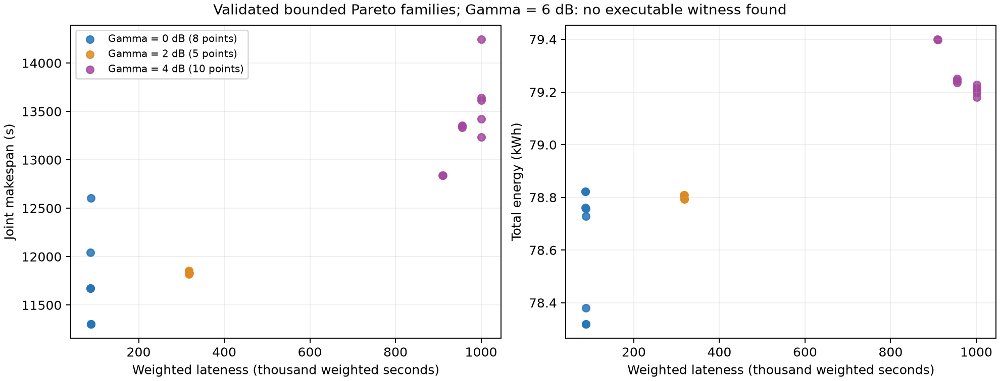

# E8 鲁棒通信预算阶段报告

Gate：**E8_PARTIAL_GAMMA6_UNRESOLVED**。0、2、4 dB 三个场景共 **23 个**方案通过独立执行验证；6 dB 在本次有限搜索内没有取得可执行见证。**不能把 E8 标为全通过，不能把 Γ6 的已知前沿为空等同于真实可行域为空。** 正式 ns-3、Q4 均未开始。

## 已验证结果

| ΓC / dB | 验证点数 | 最小已知 J_late | 对应 J_norm | 前沿最短完工 / s | 前沿最低能耗 / kWh | 中继架次 |
|---|---|---|---|---|---|---|
| 0 | 8 | 87005.086 | 0.558470231 | 11304.756 | 78.319613 | 9–10 |
| 2 | 5 | 317358.405 | 0.637377042 | 11819.944 | 78.793726 | 9–9 |
| 4 | 10 | 909226.868 | 0.902246915 | 12838.088 | 79.180723 | 10–10 |
| 6 | 0 | 未找到 | — | — | — | 未证明不可行 |

不同列的前沿极值可能属于不同方案，不能拼成一个虚构执行方案。Γ0 精确保留 E7 的八个权威点；没有重新搜索 Γ0。这里的前沿均是已知档案的非支配集合，不是全局 Pareto 前沿。

时效优先代表方案的完整资源代价如下：

| ΓC | 方案 | 完工 / s | 总能耗 / kWh | 中继架次 | 中继占用 / s | 活动通信 / s | 空闲悬停 / s | 使用能量组件 |
|---|---|---|---|---|---|---|---|---|
| 0 | Q3E8_G00_001 | 12044.375 | 78.822161 | 9 | 22760.428 | 9768.415 | 574.822 | 6 |
| 2 | Q3E8_G02_001 | 11843.727 | 78.809776 | 9 | 22794.264 | 9418.042 | 1097.569 | 6 |
| 4 | Q3E8_G04_001 | 12838.088 | 79.399408 | 10 | 25313.522 | 10947.233 | 583.315 | 6 |

全部方案保持 28 个运输架次、同一箱组/访问次序/机型，运输能耗固定为 73.47077585529216 kWh；变化来自运输时刻与资源分配、中继站点/分组/次序。两架中继机和六个能量组件的池容量没有增加，使用组件数也不是“最少必需组件数”的证明。中继占用包含准备、飞行、服务与周转，活动通信按每架中继的服务窗口并集计费，不按客户数重复计算。

## 在同一时效预算下比较鲁棒代价

使用相同绝对 J_late 上限 100000、400000、1000000，对每族分别选最短完工、最低能耗、最少中继架次。下表为共同预算 1000000；它比各场景使用不同相对 ε 锚点更适合横向比较。

| ΓC | 次级目标 | 选择方案 | 目标值 | 相对 Γ0 增量 | 相对增幅 |
|---|---|---|---|---|---|
| 0 | makespan | Q3E8_G00_006 | 11304.755580 | +0.000000 | +0.000% |
| 0 | energy | Q3E8_G00_008 | 78.319613 | +0.000000 | +0.000% |
| 2 | makespan | Q3E8_G02_004 | 11819.943900 | +515.188320 | +4.557% |
| 2 | energy | Q3E8_G02_005 | 78.793726 | +0.474113 | +0.605% |
| 4 | makespan | Q3E8_G04_001 | 12838.087698 | +1533.332119 | +13.564% |
| 4 | energy | Q3E8_G04_005 | 79.234726 | +0.915113 | +1.168% |
| 6 | makespan | 无已知见证 | — | — | — |
| 6 | energy | 无已知见证 | — | — | — |

完整表见 [共同绝对预算比较](e8/common_absolute_budget_comparison.csv)。预算内没有已知点的格子只表示搜索未提供见证；不表示该预算数学不可行。表中增量是当前固定模型、资源和有限算法所得方案的可复现代价，不是全局最小必要鲁棒成本。各场景的时效优先点可能在某个次级目标上反而较低，不能据此声称增加 Γ 总能降低能耗或时间。真实可行域随 Γ 增加而收缩，但分别搜索出的有限档案不保证嵌套。



## 模型边界与需求重建

ΓC 同时约束直连 T–G、接入 T–R、回传 R–G，即正在使用的完整路径各跳均满足 M_C ≥ ΓC。原通信物理中的衰落项不变，Γ 是额外安全余量，没有重复添加衰落。直连余量从正值降为低于 Γ 时同样需要中继；不能仅筛掉 E7 中低余量的中继站点。

从冻结的三维运输航迹按 0.5 s 重建直接链路余量，观测到的 LOS/阈值跨越细分到 0.05 s，缺口外扩 2 s 且截在飞行范围内。Γ2：34 段、22 个运输架次、合计保障区间 15619.09375 s；Γ4：40 段、28 架次、18715.53125 s；Γ6：40 个原始缺口、28 架次、19627.21875 s。Γ6 后续将早期长缺口划为最多 300 s 的原子区间，得到 56 段，Gate 检查其并集与原 40 段完全相同。这个合计是按运输任务累计的保障时长，不能当成中继活动通信时长。

候选表规模分别为 Γ2：72 站点/956 边；Γ4：71/1100；Γ6：91/1423。三个场景每段均有通信候选，所以 Γ6 不是“没有通信站点”。候选集不完备，网格定向搜索不是全 DEM 穷举。每架中继仍只在一个固定站点服务后返回；没有引入多跳、移动伴飞、新 MAC、额外中继或改变运输主结构。

## Γ6 已做的工作与剩余问题

1. 继承 E7 分组、按运输单元/原子区间重分组，并联合处理运输机、电池与中继资源。
2. 对早期任务补充靠近起降点的共同站点，枚举 35 种至多五组的早期兼容分区；证据保存在 `gamma_06/whole_gap_diagnostics/`。
3. 允许早期长缺口内的中继交接，重建 56 段候选并尝试六类分组。
4. 联合选择站点、任务到中继架次的分配和时间，每架中继允许两/三次早期架次；28 个覆盖签名的限时 MILP 都返回所建模型不可行。覆盖签名只保留往返较短的代表，且站点、区间划分、架次数受限，因此这不是原连续问题的不可行证明。

任务级通信覆盖可行，但时序、早期硬截止和两架中继的往返/周转约束尚未闭合。下一步应针对 Γ6 做可行性边界审查或更细的定向交接/站点列生成，而不是修改 Q3 箱组/路线，也不应直接推进正式 ns-3。已有有限模型的 infeasible 与整题 infeasible 必须区分。

## 搜索、验证与复现

Γ2、Γ4 沿用 E7 的 ε∈{0,1%,2%,5%,10%} × {makespan, energy, relay_sorties} 生成器。时效搜索 4 轮×28 修复，加 3 轮×24；每个 ε 次级目标 2 轮×12。先通过额外限时 MILP 取得鲁棒种子，属于不同于 Γ0 的初始化成本。MILP 按墙钟限时，重新搜索可能得到不同见证；保存见证的 CSV 重建是逐字节确定的。能耗提案用连续活动悬停时长近似排名，正式接受、比较和独立验证使用准确活动并集/空闲悬停能耗。

23 点均从 CSV 独立重算运输物理、箱级硬截止、 typed UAV/电池日历、中继飞行/悬停/能量组件和全航程通信；每点 0.5 s，并显式检查相位/任务端点、把观测边界细化到 0.1 s。三个场景各一个时效代表另作 0.25 s 加密验证，均零硬违例、零采样失联。23 点执行 CSV 全部逐字节重放一致；45 个预算查询通过检查；E6/E7 与冻结输入哈希未变。数值全航程采样仍不等于解析连续时间证明。

```bash
export OPENBLAS_NUM_THREADS=1 OMP_NUM_THREADS=1 MKL_NUM_THREADS=1
.venv/bin/python -m src.q3.e8_replay --check-all
.venv/bin/python validation/mathematical/e8_gate.py
.venv/bin/python -m src.q3.e8_replay --gamma 4 --epsilon .02 --objective energy --output results/q3/e8/generated/g4_e02_energy
# 对生成包重新绑定审计路径：
.venv/bin/python validation/mathematical/e8_validate.py --directory results/q3/e8/generated/g4_e02_energy --step .5
```

从已存候选重新搜索使用模块位置参数：`.venv/bin/python -m src.q3.e8_seed_variants 2`，随后 `e8_pareto 2`、`e8_audit_batch 2`。这些命令会改写该场景，必须重新生成报告、重放及 Gate；不要把历史 Gate 当成新结果的认证。完整模型口径见 [E8 semantics](../../docs/model/Q3_ROBUSTNESS_E8_SEMANTICS.md)。

## 阶段状态

Q1 DONE；Q2 Pareto DONE；Q3 通信物理/中继候选/资源闭环/联合 Pareto DONE（E7）；E8 PARTIAL（Γ0/2/4 已验证，Γ6 未闭合）；ns-3 正式验证 WAIT；Q4 独立分区 WAIT；论文/图表/提交表 WAIT。本阶段只交付 E8 研究图表，未开始最终论文整合。
