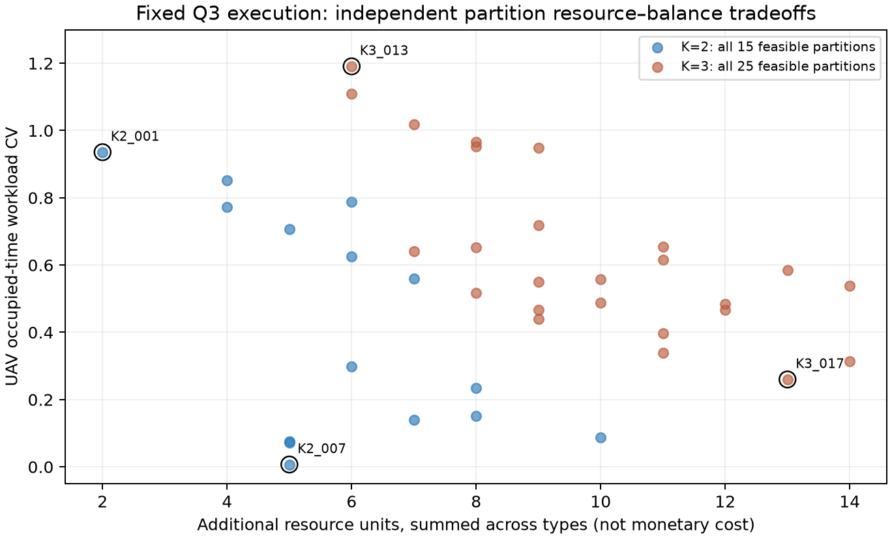
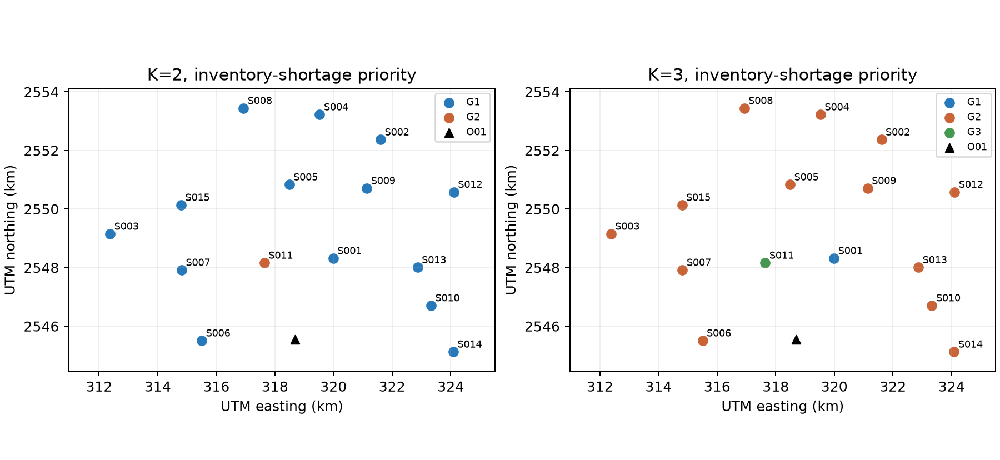

# Q4 独立分区与资源配置报告

Gate：**Q4_INDEPENDENT_PARTITIONS_READY**。基于标准 ΓC=0 的 **Q3E7_001**，保持任务、箱组、访问次序、时刻及通信保障关系不变，完成 K=2/3 全部合法分区的精确枚举和独立资源核算。E8-B 不再是 Q4 门禁。

这里 READY 表示分区、最小需求和缺口已正确求出，不表示现有库存足以执行独立分区。**在本次冻结方案及整架次不可拆依赖口径下，2 组和 3 组均不存在零库存缺口分区**；穷举分别为 15 个、25 个，最低缺口分别为 2 件和 6 件。这是固定 Q3 输入上的确切结论，不是所有 Q3 方案或允许重调度后的全局结论。

## 分区口径

同一运输架次涉及的服务区必须同组。为同时保持完整中继架次安排、通信关系和组间独立性，一个中继架次保障的所有运输架次也必须同组；不复制、不切开既有中继架次。此前冻结的依赖超图架构因此收缩成下列五块：

| 不可拆块 | 服务区 |
|---|---|
| 1 | S001 |
| 2 | S002,S003,S005,S006,S007,S008 |
| 3 | S004,S010,S012,S013,S014 |
| 4 | S009,S015 |
| 5 | S011 |

按五个不可拆块精确枚举，Stirling 数 S(5,2)=15、S(5,3)=25。原物理机号可以重新分配为组内专用资源编号，否则把原来跨时段复用的机号也当不可拆依赖，会错误改变“独立资源需求核算”的问题。所有任务开始/结束、返航、充电完成时刻及源机号均保留，可追溯核验。

## 代表方案及资源代价

未给设备采购单价，因此没有捏造货币成本。完整 Pareto 使用八维资源需求向量与工作量 CV。便于提交的缺口优先代表按“新增资源总件数最小 → 资源总件数最小 → CV 最小”选取；同时给出均衡优先代表，避免把高度失衡的最低缺口分区说成唯一最佳答案。

| 角色 | 方案 | 资源总件数 | 新增缺口件数 | 工作量 CV | 库存可独立执行 |
|---|---|---|---|---|---|
| 缺口优先 | Q4_K2_001 | 28 | 2 | 0.935562 | 否，需补足所列缺口 |
| 缺口优先 | Q4_K3_013 | 33 | 6 | 1.190765 | 否，需补足所列缺口 |
| 均衡优先 | Q4_K2_007 | 33 | 5 | 0.006958 | 否，需补足所列缺口 |
| 均衡优先 | Q4_K3_017 | 42 | 13 | 0.259795 | 否，需补足所列缺口 |

| 资源类型 | 现库存 | 不分组最小池 | K2 缺口优先需求 | K2 缺口 | K3 缺口优先需求 | K3 缺口 |
|---|---|---|---|---|---|---|
| TUAV_A | 4 | 4 | 4 | 0 | 4 | 0 |
| TUAV_B | 2 | 2 | 3 | 1 | 4 | 2 |
| TUAV_C | 2 | 2 | 2 | 0 | 3 | 1 |
| TBAT_A | 6 | 4 | 5 | 0 | 5 | 0 |
| TBAT_B | 4 | 4 | 5 | 1 | 6 | 2 |
| TBAT_C | 4 | 3 | 3 | 0 | 5 | 1 |
| RUAV | 2 | 2 | 2 | 0 | 2 | 0 |
| REC | 6 | 4 | 4 | 0 | 4 | 0 |

资源向量顺序为 A/B/C 运输机、A/B/C 电池、中继机、中继能源组件。缺口优先 K2 需要新增 **B 型运输机 1 架、B 型电池 1 组**。K3 需要新增 **B 型运输机 2 架、C 型运输机 1 架、B 型电池 2 组、C 型电池 1 组**。

值得注意：K2 所需资源总件数 28 小于现库存总件数 30，却仍有两件类型缺口。A 型电池或中继组件的富余不能替代 B 型运输机/电池。因此必须报告分类型缺口，不能仅比较总数量。

| 方案 | 组 | 服务区 | 箱数 | 质量/kg | 无人机占用/s | 资源向量 |
|---|---|---|---|---|---|---|
| Q4_K2_001 | G1 | S001,S002,S003,S004,S005,S006,S007,S008,S009,S010,S012,S013,S014,S015 | 77 | 733.00 | 68622.522 | [3, 2, 2, 4, 4, 3, 2, 4] |
| Q4_K2_001 | G2 | S011 | 3 | 25.00 | 2284.547 | [1, 1, 0, 1, 1, 0, 0, 0] |
| Q4_K3_013 | G1 | S001 | 15 | 154.00 | 5220.544 | [0, 1, 1, 0, 1, 2, 0, 0] |
| Q4_K3_013 | G2 | S002,S003,S004,S005,S006,S007,S008,S009,S010,S012,S013,S014,S015 | 62 | 579.00 | 63401.978 | [3, 2, 2, 4, 4, 3, 2, 4] |
| Q4_K3_013 | G3 | S011 | 3 | 25.00 | 2284.547 | [1, 1, 0, 1, 1, 0, 0, 0] |
| Q4_K2_007 | G1 | S001,S002,S003,S005,S006,S007,S008 | 53 | 524.00 | 35700.212 | [2, 1, 2, 3, 2, 3, 1, 2] |
| Q4_K2_007 | G2 | S004,S009,S010,S011,S012,S013,S014,S015 | 27 | 234.00 | 35206.857 | [3, 2, 1, 3, 3, 1, 2, 2] |
| Q4_K3_017 | G1 | S001,S009,S011,S015 | 24 | 229.00 | 15584.707 | [1, 2, 1, 1, 3, 2, 1, 1] |
| Q4_K3_017 | G2 | S002,S003,S005,S006,S007,S008 | 38 | 370.00 | 30479.668 | [2, 1, 2, 3, 2, 3, 1, 2] |
| Q4_K3_017 | G3 | S004,S010,S012,S013,S014 | 18 | 159.00 | 24842.694 | [2, 2, 1, 2, 2, 1, 2, 2] |

## 资源最小性、冗余与均衡

运输机占用 [准备开始,返航)，同型电池占用 [起飞,充至100%)；中继机占用 [准备开始,返航加周转)，组件占用 [起飞,充至100%)。组内同类资源的最小数等于这些区间的最大重叠数：最大团提供下界，区间着色提供达到该下界的实际日历。数值端点容差为 1e-6 s。按机型单独计算，且跨组不复用任何资源。

独立分区冗余定义为各组最小需求之和减去同一冻结任务不分组时的最小池；与“现库存剩余”区分。缺口优先 K2/K3 分别比不分组最小池增加 3/8 件资源。原 E7 使用过六个组件编号，但区间重分配证明不分组最小池是四个；不能把“曾使用编号数量”误当最少需求。

工作量为每组运输机准备至返航占用时长与中继机准备至周转完成占用时长之和，CV 用总体标准差除以平均值。另报告箱数、质量和任务数；不把服务区数量相等当作工作量均衡。最低缺口方案把大量任务留在一个大组，所以 CV 较高；均衡方案分别把 CV 降到约 0.0070 / 0.2598，但新增资源缺口增加到 5 / 13 件。





按类型看，独立池的需求是各组峰值相加，不是全体任务峰值；峰值发生在不同时刻时，禁止跨组调配仍要求各组保有自己的资源。原 Q3 的时间复用收益因此损失。源方案全部物理任务未变，交付时刻、联合完工时间和运输/中继能耗保持原值；多配置设备不等于新增飞行任务。

## 验证、提交与边界

独立验证器不导入分区优化代码：以图遍历重建连通块，用另一套全标号枚举核对 40 个分区，用事件扫描计算全部资源峰值，并检查每个峰值证书和四套导出资源日历。逐字段核对源任务和通信关系不变，重新分配的资源不跨组、类型正确且不重叠。3 个拒绝测试覆盖篡改任务时刻、少报资源需求和切断中继依赖。

提供与官方 Q4 表头一致的 [缺口优先工作簿](Q4_分区配置_缺口优先.xlsx) 和 [均衡优先工作簿](Q4_分区配置_均衡优先.xlsx)，已回读逐单元格核对；均只是 Q4 页草稿，不是全题最终提交文件。[组配置 CSV](group_configurations.csv) 与 solutions 下完整执行配置可供整合。

```bash
export OPENBLAS_NUM_THREADS=1 OMP_NUM_THREADS=1
.venv/bin/python -m src.q4.partition
.venv/bin/python -m src.q4.report
.venv/bin/python validation/mathematical/q4_validate.py
.venv/bin/python validation/mathematical/test_q4_regressions.py
```

源 Q3 的通信物理已通过独立全航程采样，Q4 通过源审计哈希及逐字段继承维持该证明链，没有再跑无变化的射线传播。最小性是固定任务时间/依赖结构下的精确结果；若更换 E7 点、允许移动任务时刻、复制/拆分中继，必须作为另一个模型重新计算，不能套用本结论。
